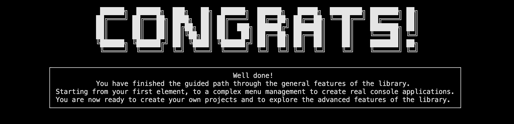

# Next steps

Now, you can go further and explore the library by yourself. Here are the resources available:

- The [references](https://morgankryze.github.io/ConsoleAppVisuals/3-references/index.html) section where you can find all methods, properties and classes with their description and all arguments available.
- The [articles](https://morgankryze.github.io/ConsoleAppVisuals/5-articles/index.html) section where you can find some additional articles (create your element, use fonts, create your documentation, etc.).
- The [example project](https://github.com/MorganKryze/ConsoleAppVisuals/blob/main/example/) where we demonstrate all the basic features of the library.
- The [release notes](https://github.com/MorganKryze/ConsoleAppVisuals/releases) of the latest version of the library. Consider checking it to see if there are any new features or bug fixes to stay up to date. Updating instructions available [here](https://morgankryze.github.io/ConsoleAppVisuals/introduction/first_app.html).

If you have any questions, feel free to ask them in the [discussions](https://github.com/MorganKryze/ConsoleAppVisuals/discussions) section or [open an issue](https://github.com/MorganKryze/ConsoleAppVisuals/issues) (templates are available to help you).

For now, no known project is using the version 3.x.x of the library. If you are using our library feel free to [notify us](mailto:morgan@kodelab.fr) and we will add your project to the list to inspire people and show the potential of the library.

Finally, do not hesitate to **star** and **share** the project on [GitHub](https://github.com/MorganKryze/ConsoleAppVisuals/) if you like it! Your input helps us understand possible use cases and make necessary improvements.
