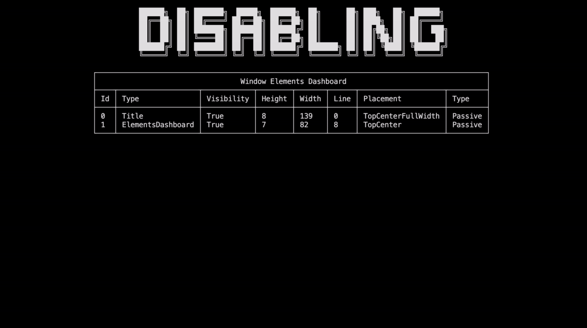
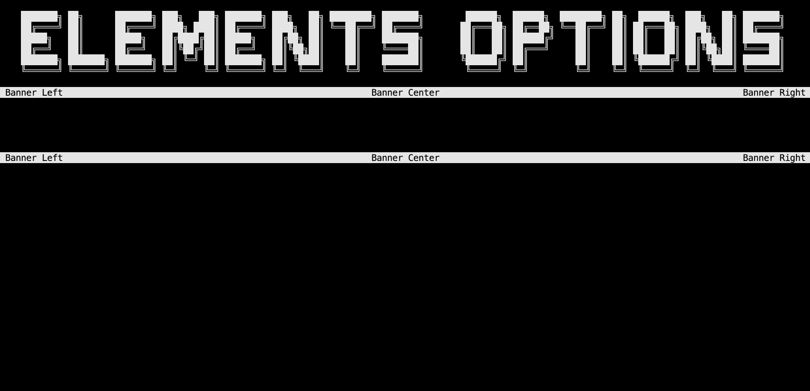
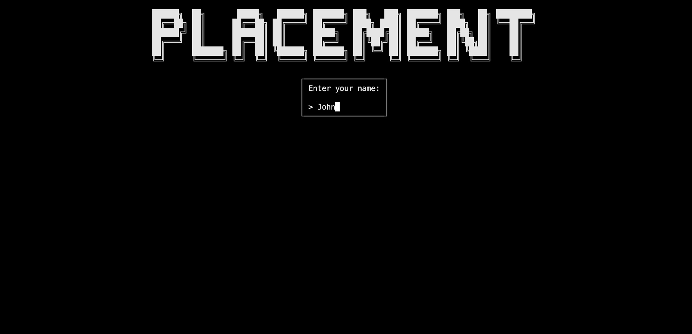
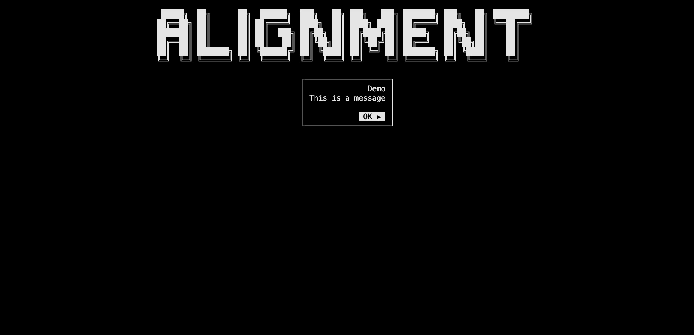
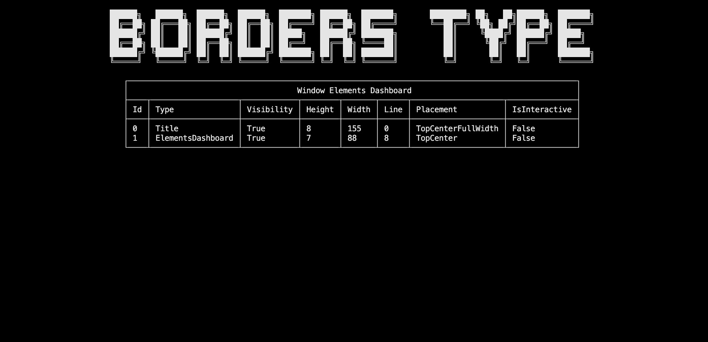
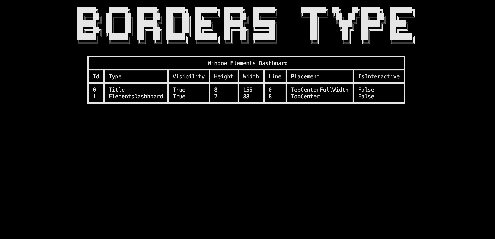

# Elements options

In this section, you will learn:

- How to deactivate/ remove elements
- How to use the `ElementsDashboard` inspector element
- How to use the `HeightSpacer` element
- Discover `Placement`, `TextAlignment` and `BordersType` enumerations
- How to use the full potential of the element options

## Setup

> [!WARNING]
> We will add `using ConsoleAppVisuals.Enums;` to the using statements to use the `Placement` and `TextAlignment` enumerations.

And your cleaned `Program.cs` file should look like this:

[!code-csharp[](../assets/code/ProgramDemo.cs?highlight=4)]

## Disabling elements

We tackled adding elements to the window. Now, let's see how to do the opposite.

To disable element rendering, you have two options:

- Deactivate the element
- Remove the element

### Deactivating

Deactivating an element can be useful for it to be used later. To do so, let's create a `Title` element and deactivate it. Nothing will be rendered on the screen.

```csharp
Window.Open();

Title title = new Title("Elements options");
Window.AddElement(title);

Window.DeactivateElement(title);

Window.Render();

Window.Close();
```

Let's see how to perceive the effect of deactivating an element. Update your code to add a `ElementsDashboard` _passive_ element and deactivate the title. The dashboard will be rendered, but not the title:

> [!NOTE]
> The method `Window.Freeze()` is used to stop the execution by waiting the user to press a key (Enter by default) to see the window content without exiting the application when the window only contains _passive_ elements.

```csharp
Window.Open();

Title title = new Title("Elements options");
Window.AddElement(title);

ElementsDashboard dashboard = new ElementsDashboard();
Window.AddElement(dashboard);

Window.Render();
Window.Freeze();

Window.DeactivateElement(title);

Window.Render();
Window.Freeze();

Window.Close();
```


As you noticed, the title is not rendered on the screen because its `Visibility` property has been set to false.

### Removing

Removing an element is useful when you don't want to use it anymore. To do so, let's create a `Title` element and remove it. Nothing will be rendered on the screen.

```csharp
Window.Open();

Title title = new Title("Disabling");
Window.AddElement(title);

Window.RemoveElement(title);

Window.Render();

Window.Close();
```

Let's see how to perceive the effect of removing an element. Update your code to the following:

```csharp
Window.Open();

Title title = new Title("Disabling");
Window.AddElement(title);

ElementsDashboard dashboard = new ElementsDashboard();
Window.AddElement(dashboard);

Window.Render();
Window.Freeze();

Window.RemoveElement(title);

Window.Render();
Window.Freeze();

Window.Close();
```



## Setting a height spacer between elements

Sometimes, you may want to add a space between elements. To do so, you can use the `HeightSpacer` element. It is a _passive_ element that will only render a space of a specific height between elements.

Here is a concrete example between two banners:

```csharp
Window.Open();

Title title = new Title("Elements options");
Window.AddElement(title);

Banner banner1 = new Banner();
HeightSpacer spacer = new HeightSpacer(5);
Banner banner2 = new Banner();

Window.AddElement(banner1, spacer, banner2);

Window.Render();
Window.Freeze();

Window.Close();
```



> [!NOTE]
> You may update afterward the `Placement` and `Height` of the `HeightSpacer` element using the `UpdatePlacement()` and `UpdateHeight()` methods.

## Access and update elements parameters

In all the tutorials and the [example project](https://github.com/MorganKryze/ConsoleAppVisuals/blob/main/example/) the elements definitions are simplified and do not declare all the arguments available. To see all the arguments available for each element, you can consult the [references documentation](https://morgankryze.github.io/ConsoleAppVisuals/references/index.html).

Most of them are specific with generic type (`string`, `int`, `bool`, `List`, ...) and are used to customize the element. But some of them are common to all elements and are used to place the element on the window. These are the `Placement` and `TextAlignment` enumerations.

### `Placement`

The `Placement` enumeration is used to place elements at a convenient location on the window. It is used by every element from the library that can be placed on the window. According to the placement, the element position and line will be calculated and rendered.

The available values are:

- `TopLeft`: x(line) = 0, y(char) = 0


- `TopCenter`: (Default) x(line) = 0, y(char) = windowWidth / 2



- `TopRight`: x(line) = 0, y(char) = windowWidth


- `TopCenterFullWidth`: x(line) = 0, y(char) = 0 (In fact, it is the same as `TopLeft` but we know that the element will be rendered with the full width of the window, following top elements will be placed below it)


- `BottomCenterFullWidth`: x(line) = windowHeight, y(char) = 0 (In preview for now as not fully implemented)


> [!NOTE]
> To choose the placement of an element, you can either set it from the constructor or use the `UpdatePlacement()` method after creating the element.
>
> ```csharp
> Prompt prompt = new Prompt("Enter your name:", "John", Placement.TopCenter);
> // or
> prompt.UpdatePlacement(Placement.TopCenter);
> ```

### `TextAlignment`

The `TextAlignment` enumeration is used to align the text in a string. It is used by some elements from the library. Here are the available values:

- `Left`: Align the text to the left


- `Center`: (Default) Align the text to the center


- `Right`: Align the text to the right



> [!NOTE]
> To choose the text alignment of an element, you can either set it from the constructor or use the `UpdateTextAlignment()` method after creating the element (some elements may not have this method if the text alignment is not used in it so refer to the references documentation to get that specific information).
>
> ```csharp
> Dialog dialog = new Dialog(new List<string>(){"Demo", "This is a message"}, null, "OK ▶", TextAlignment.Center);
> // or
> dialog.UpdateTextAlignment(TextAlignment.Center);
> ```

### `BordersType`

The `BordersType` enumeration is used to set the borders of an element. It is used by the table and embed elements from the library. Here are the available values:

- `SingleStraight`: (Default) Single lines with straight corners



- `SingleRound`: Single lines with round corners


- `SingleBold`: Single bold lines with straight corners



- `DoubleStraight`: Double lines with straight corners


- `ASCII`: ASCII basic characters for the borders (`+`, `-`, `|` only)


> [!WARNING]
> The following types may not work on Visual Studio or Windows Command Prompt:
>
> - `SingleRound`
> - `SingleBold`

> [!NOTE]
> To choose the border type of an element, you can either set it from the constructor or use the `UpdateBordersType()` method after creating the element (some elements may not have this method if the border type is not used in it so refer to the references documentation to get that specific information).
>
> ```csharp
> ElementsDashboard dashboard = new ElementsDashboard(Placement.TopCenter, BordersType.SingleStraight);
> // or
> dashboard.UpdateBordersType(BordersType.SingleStraight);
> ```

## Conclusion

In this section, you learned how to deactivate and remove elements from the window. You also discovered the `Placement` and `TextAlignment` enumerations and how to use the full potential of the element options by knowing all the arguments available. You may now be able to use more complex elements and place them at your desired location.

---

Have a question, give a feedback or found a bug? Feel free to [open an issue](https://github.com/MorganKryze/ConsoleAppVisuals/issues) or [start a discussion](https://github.com/MorganKryze/ConsoleAppVisuals/discussions) on the GitHub repository.
