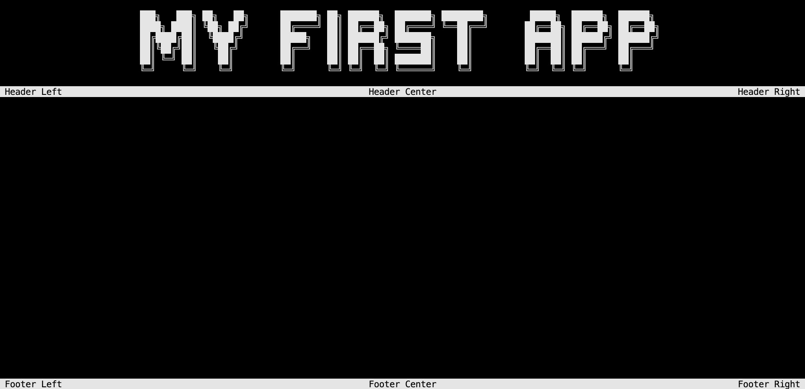
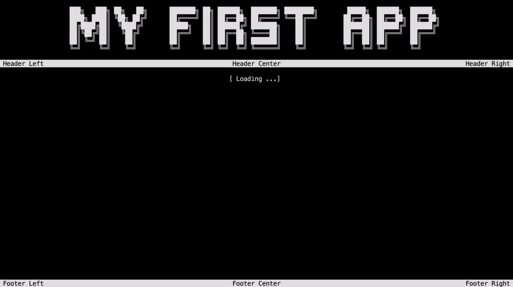
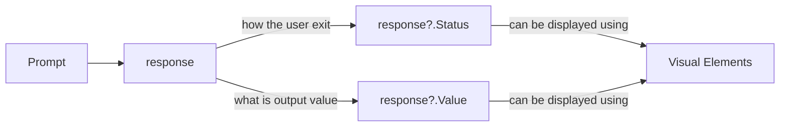

# First app

This tutorial will show you how to create a simple console application using the `ConsoleAppVisuals` package. You will learn:

- How to add elements
- Discover: `Title`, `Header`, `Footer`, `FakeLoadingBar`, `Prompt` and finally `Dialog` elements
- How to get the response from the user
- How to exit the application

## Setup

First, let's create a dummy project to work with. Please choose your method according to your preference:

# [.NET CLI](#tab/cli)

Open your terminal and navigate to the folder where you want to create your project. Run the following command:

```bash
dotnet new console --output MyApp --use-program-main
```

If your file structure is like this:

```bash
Example_project  <-- root
└───MyApp
    ├───obj
    ├───MyApp.csproj
    └───Program.cs
```

Jump into the `MyApp` folder:

```bash
cd MyApp
```

Finally, run the following command to install the library:

```bash
dotnet add package ConsoleAppVisuals
```

> [!TIP]
> Consider running the same command to update the package to the latest version, stay tuned!

# [Visual Studio](#tab/vs)

If you are using Visual Studio, launch the app and follow these steps in the video to create a new project:

> [!Video https://www.youtube.com/embed/1TqKF3ZJodk]

Then, install the `ConsoleAppVisuals` package by following these steps in the video and searching for `ConsoleAppVisuals`.

> [!WARNING]
> The video is about the `Newtonsoft.Json` package. You need to search for `ConsoleAppVisuals` package instead.

> [!Video https://www.youtube.com/embed/IprbRazS3b8]

> [!TIP]
> Consider updating the package often to the latest version, stay tuned! More info on this [page](https://learn.microsoft.com/nuget/consume-packages/install-use-packages-visual-studio#update-a-package).

---

Open the `Program.cs` file and ensure that the content is the following:

```csharp
namespace MyApp
{
    internal class Program
    {
        static void Main(string[] args)
        {
            Console.WriteLine("Hello World!");
        }
    }
}
```

# [.NET CLI](#tab/cli)

Let's try to run the app by typing the following command in your terminal:

```bash
dotnet run
```

# [Visual Studio](#tab/vs)

Let's try to run the app by clicking on the green arrow at the top of the window.


---

## Building the app

> [!WARNING]
> Add these using statements at the top of your `Program.cs` file to use the `ConsoleAppVisuals` package and its elements:
>
> ```csharp
> using ConsoleAppVisuals;
> using ConsoleAppVisuals.PassiveElements;
> using ConsoleAppVisuals.InteractiveElements;
> using ConsoleAppVisuals.AnimatedElements;
> ```
>
> Sometimes, you will need to add more statements. All available namespaces are available in the [references](https://morgankryze.github.io/ConsoleAppVisuals/3-references/index.html) section.

Let's start by removing `Console.WriteLine("Hello World!");` instruction and adding the following line to your `Main` method to set up the console (clear and set the cursor invisible):

```csharp
Window.Open();
```

Now, let's create a minimal app with a `Title`, a `Header`, a `Footer`, a `FakeLoadingBar` and finally a `Prompt` element.

### `Title`

Now we can use all the elements from the package. Our first _passive_ element will be a `Title`. [Learn more](https://morgankryze.github.io/ConsoleAppVisuals/3-references/ConsoleAppVisuals.PassiveElements.Title.html)

```csharp
Title title = new Title("My first app");
```

Then we can add it to the `Window`:

```csharp
Window.AddElement(title);
```

And finally, we can render the `Title` from the `Window`:

```csharp
Window.Render(title);
```


> [!TIP]
> You may update the style of the `Title` element like the one below by giving a look at this article: [create and use fonts](https://morgankryze.github.io/ConsoleAppVisuals/5-articles/create_font.html).
>
> 

### `Header`, `Footer`

Add the [`Header`](https://morgankryze.github.io/ConsoleAppVisuals/3-references/ConsoleAppVisuals.PassiveElements.Header.html) and [`Footer`](https://morgankryze.github.io/ConsoleAppVisuals/3-references/ConsoleAppVisuals.PassiveElements.Footer.html) _passive_ elements to the `Window`:

```csharp
Header header = new Header();
Footer footer = new Footer();
Window.AddElement(header, footer);

Window.Render();
```

Instead of rendering each element separately, we rendered the `Title`, `Header` and `Footer` elements at once using the `Window.Render()` method. So you may remove the `Window.Render(title)` instruction.



### `FakeLoadingBar`

Now let's add a `FakeLoadingBar` _animated_ element to your previous code and run it. [Learn more](https://morgankryze.github.io/ConsoleAppVisuals/3-references/ConsoleAppVisuals.InteractiveElements.FakeLoadingBar.html)

```csharp
FakeLoadingBar loadingBar = new FakeLoadingBar();
Window.AddElement(loadingBar);

Window.Render(loadingBar);
```

> [!WARNING]
> As you may have noticed, we have the same output as earlier. No loading bar was rendered on the console. **Passive elements** are **activated by default** when added to the window. On the contrary, **interactive and animated elements** need to be **activated manually**.

To do so, **replace** the `Window.Render(loadingBar)` instruction with the following:

```csharp
Window.ActivateElement(loadingBar);
```



> [!TIP]
> The method `Window.ActivateElement()` will activate the element and render it on the console. Do not forget to write `Window.Render()` before to render the other _passive_ elements like `Title`, `Header` or `Footer` for example.

### `Prompt`

Now let's add a `Prompt` _interactive_ element to your previous code and run it. [Learn more](https://morgankryze.github.io/ConsoleAppVisuals/3-references/ConsoleAppVisuals.InteractiveElements.Prompt.html)

```csharp
Prompt prompt = new Prompt("What's your name?");
Window.AddElement(prompt);

Window.ActivateElement(prompt);
```


### Get response and `Dialog` element

A `Prompt` element will give you different interaction information. To get these information, let's add the following line of code after the `Window.ActivateElement(prompt)` line. [Learn more about `var`](https://learn.microsoft.com/dotnet/csharp/language-reference/statements/declarations#implicitly-typed-local-variables)

```csharp
var response = prompt.GetResponse();
```

The previous line will retrieve a response object that has the following properties:

- `Status`: is how the interaction ended. It can be `Selected` (pressed enter), `Deleted` (pressed delete) or `Escaped` (pressed escape). It is accessible using: `response?.Status`.
- `Value`: is the user's response data. Its type depends on the `InteractiveElement` you are using. In this case, the `Prompt` element returns a `string`. It is accessible using: `response?.Value`.



> [!NOTE]
> Here we use the `?.` operator to avoid a `NullReferenceException` if the response is `null`.
> Meaning:
>
> - If `response` is `null`, `response?.Status` will return `null`.
> - If `response` is not `null`, `response?.Status` will return `response.Status`.
>
> If you are certain that `response` is not `null`, you can use `response!.Status` directly. This will indicate to the compiler that `response` cannot be `null` in your configuration.

Finally, let's add a `Dialog` _interactive_ element to display the user's response on the console.The `Dialog` is _interactive_ too and will give you a response. You may catch it if needed (as you may create an element with 0, 1 or 2 options, it will give you the selected option). [Learn more](https://morgankryze.github.io/ConsoleAppVisuals/3-references/ConsoleAppVisuals.InteractiveElements.Dialog.html)

```csharp
Dialog text = new Dialog(
    new List<string>()
    {
        "You just wrote " + response!.Value + "!",
        "And you " + response!.Status + "!"
    },
    null,
    "OK"
    );
Window.AddElement(text);
Window.ActivateElement(text);
```


### Exit the application

Finally, let's exit smoothly the application:

```csharp
Window.Close();
```


## Conclusion

And that's it! You have created your first app using the `ConsoleAppVisuals` package. You can now run the app and see the result.

Here is the full code:

```csharp
Window.Open();

Title title = new Title("My first app");
Window.AddElement(title);

Header header = new Header();
Footer footer = new Footer();
Window.AddElement(header, footer);

Window.Render();

FakeLoadingBar loadingBar = new FakeLoadingBar();
Window.AddElement(loadingBar);
Window.ActivateElement(loadingBar);

Prompt prompt = new Prompt("What's your name?");
Window.AddElement(prompt);
Window.ActivateElement(prompt);

var response = prompt.GetResponse();

Dialog text = new Dialog(
    new List<string>()
    {
        "You just wrote " + response!.Value + "!",
        "And you " + response!.Status + "!"
    },
    null,
    "OK"
    );
Window.AddElement(text);
Window.ActivateElement(text);

Window.Close();
```

---

Have a question, give a feedback or found a bug? Feel free to [open an issue](https://github.com/MorganKryze/ConsoleAppVisuals/issues) or [start a discussion](https://github.com/MorganKryze/ConsoleAppVisuals/discussions) on the GitHub repository.
