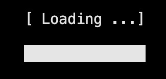

# Animated

| Visual                                                        | Description                                                                                                                                      | Documentation                                                                                                                   |
| ------------------------------------------------------------- | ------------------------------------------------------------------------------------------------------------------------------------------------ | ------------------------------------------------------------------------------------------------------------------------------- |
|  | The `FakeLoadingBar` is used to create a static loading bar with a defined duration.                                                             | [Read more](https://morgankryze.github.io/ConsoleAppVisuals/3-references/ConsoleAppVisuals.AnimatedElements.FakeLoadingBar.html) |
|      | The `LoadingBar` class is used to create a dynamic loading bar. It is a simple animated element that you may use to show the progress of a task. | [Read more](https://morgankryze.github.io/ConsoleAppVisuals/3-references/ConsoleAppVisuals.AnimatedElements.LoadingBar.html)     |

---

Have a question, give a feedback or found a bug? Feel free to [open an issue](https://github.com/MorganKryze/ConsoleAppVisuals/issues) or [start a discussion](https://github.com/MorganKryze/ConsoleAppVisuals/discussions) on the GitHub repository.
