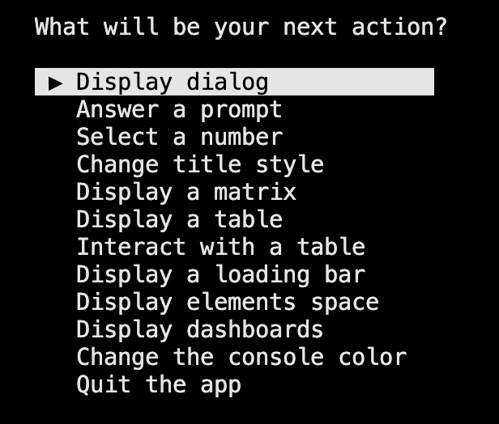

# Interactive

| Visual                                                           | Description                                                                                                                          | Documentation                                                                                                                     |
| ---------------------------------------------------------------- | ------------------------------------------------------------------------------------------------------------------------------------ | --------------------------------------------------------------------------------------------------------------------------------- |
|                  | The `Dialog` is interaction box providing 0, 1 or 2 options to the user.                                                             | [Read more](https://morgankryze.github.io/ConsoleAppVisuals/3-references/ConsoleAppVisuals.InteractiveElements.Dialog.html)        |
|  | The `FloatSelector` display a roulette letting you choose a number given a range and a step.                                         | [Read more](https://morgankryze.github.io/ConsoleAppVisuals/3-references/ConsoleAppVisuals.InteractiveElements.FloatSelector.html) |
|    | Very similar to the `FloatSelector`, the `IntSelector` is used to select an integer.                                                 | [Read more](https://morgankryze.github.io/ConsoleAppVisuals/3-references/ConsoleAppVisuals.InteractiveElements.IntSelector.html)   |
|                  | The `Prompt` is a simple input box that allows the user to enter a string (Different input types available for secrecy for example). | [Read more](https://morgankryze.github.io/ConsoleAppVisuals/3-references/ConsoleAppVisuals.InteractiveElements.Prompt.html)        |
|   | The `ScrollingMenu` is a menu that allows the user to scroll through a list of choices.                                              | [Read more](https://morgankryze.github.io/ConsoleAppVisuals/3-references/ConsoleAppVisuals.InteractiveElements.ScrollingMenu.html) |
|   | The `TableSelector` is a table that allows the user to select a row.                                                                 | [Read more](https://morgankryze.github.io/ConsoleAppVisuals/3-references/ConsoleAppVisuals.InteractiveElements.TableSelector.html) |

---

Have a question, give a feedback or found a bug? Feel free to [open an issue](https://github.com/MorganKryze/ConsoleAppVisuals/issues) or [start a discussion](https://github.com/MorganKryze/ConsoleAppVisuals/discussions) on the GitHub repository.
