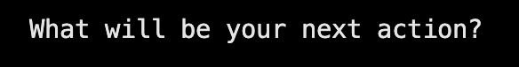
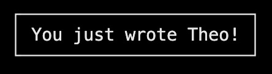
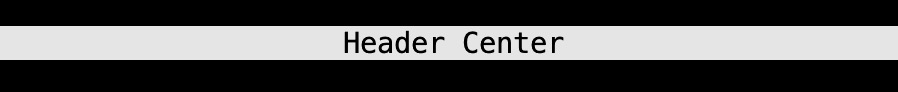
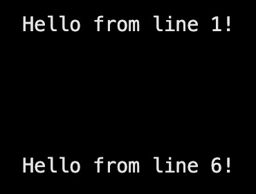
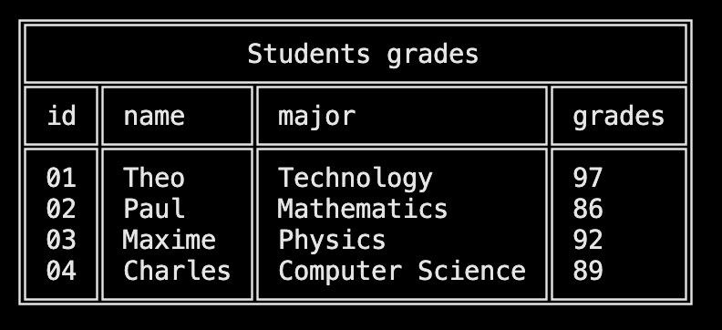
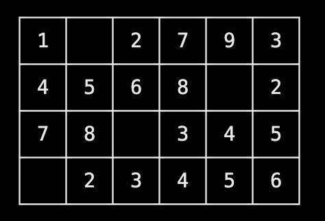
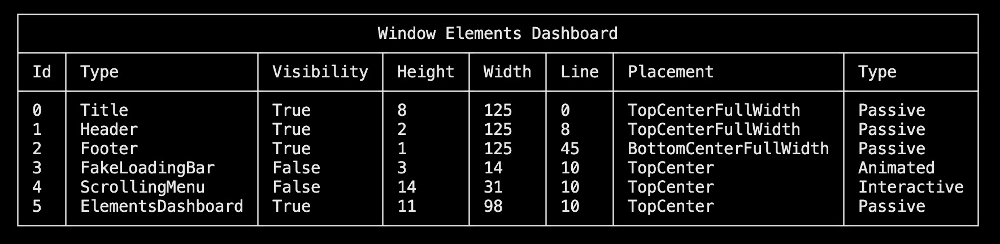
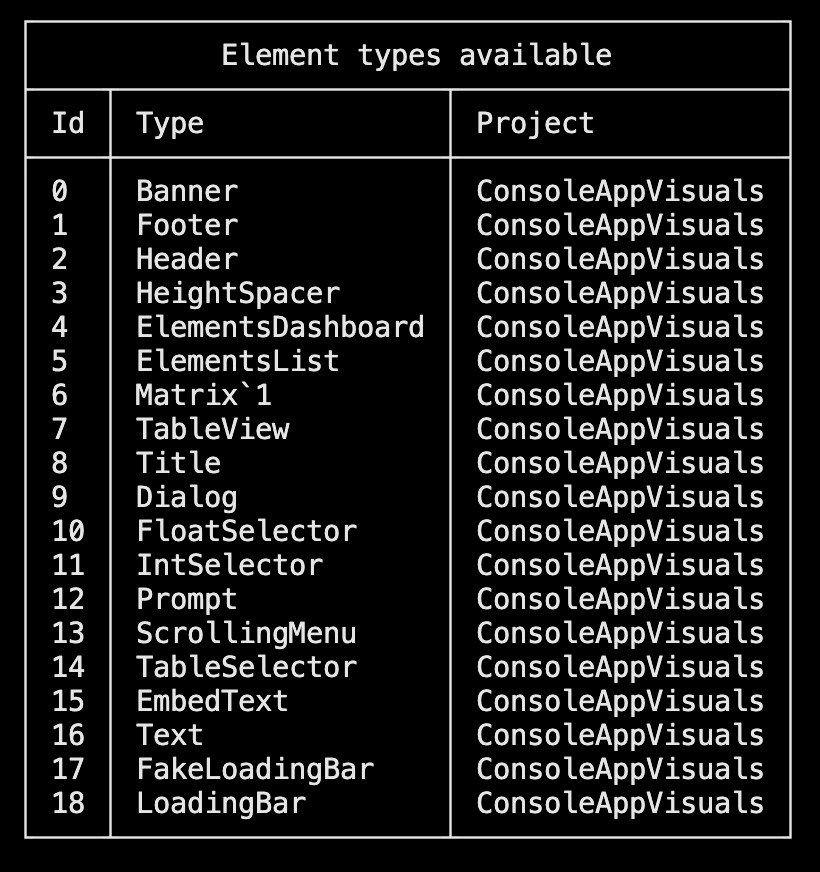

# Passive

## Classic elements

| Visual                                                        | Description                                                                                                            | Documentation                                                                                                                |
| ------------------------------------------------------------- | ---------------------------------------------------------------------------------------------------------------------- | ---------------------------------------------------------------------------------------------------------------------------- |
|                   | The `Text` is a simple text element that can be used to display information to the user.                               | [Read more](https://morgankryze.github.io/ConsoleAppVisuals/3-references/ConsoleAppVisuals.PassiveElement.Text.html)         |
|        | The `EmbedText` is a text element that has been embed. Nothing more.                                                   | [Read more](https://morgankryze.github.io/ConsoleAppVisuals/3-references/ConsoleAppVisuals.PassiveElement.EmbedText.html)    |
|                 | The `Title` is a text element that can be used to display a title at the top of the console. (You may change the font) | [Read more](https://morgankryze.github.io/ConsoleAppVisuals/3-references/ConsoleAppVisuals.PassiveElement.Title.html)        |
|               | The `Banner` is a text element that can be used to display a banner.                                                   | [Read more](https://morgankryze.github.io/ConsoleAppVisuals/3-references/ConsoleAppVisuals.PassiveElement.Banner.html)       |
|               | The `Header` is a banner placed at the top of the console.                                                             | [Read more](https://morgankryze.github.io/ConsoleAppVisuals/3-references/ConsoleAppVisuals.PassiveElement.Header.html)       |
|               | The `Footer` is a banner placed at the bottom of the console                                                           | [Read more](https://morgankryze.github.io/ConsoleAppVisuals/3-references/ConsoleAppVisuals.PassiveElement.Footer.html)       |
|  | The `HeightSpacer` is a passive element that can be used to add a vertical space.                                      | [Read more](https://morgankryze.github.io/ConsoleAppVisuals/3-references/ConsoleAppVisuals.PassiveElement.HeightSpacer.html) |
|        | The `TableView` is a passive element that can be used to display a table. (You may change the style fo the borders)    | [Read more](https://morgankryze.github.io/ConsoleAppVisuals/3-references/ConsoleAppVisuals.PassiveElement.TableView.html)    |
|               | The `Matrix` is a passive element that can be used to display a matrix. (You may also change its style)                | [Read more](https://morgankryze.github.io/ConsoleAppVisuals/3-references/ConsoleAppVisuals.PassiveElement.Matrix.html)       |

## "Inspectors" elements

These are debugging elements and should not be used in a production environment. They are not very customizable and are intended to be used for debugging purposes only.

| Visual                                                         | Description                                                                                                                                                                                                                         | Documentation                                                                                                                     |
| -------------------------------------------------------------- | ----------------------------------------------------------------------------------------------------------------------------------------------------------------------------------------------------------------------------------- | --------------------------------------------------------------------------------------------------------------------------------- |
|  | The `ElementsDashboard` is a passive element that can be used to display the list of elements currently stored in the `Window`.                                                                                                     | [Read more](https://morgankryze.github.io/ConsoleAppVisuals/3-references/ConsoleAppVisuals.PassiveElement.ElementsDashboard.html) |
|   | The `ElementsList` is a passive element that can be used to display the list of elements currently available (from the library or the local project). You may select the type expected (Default, Passive, Interactive or Animated). | [Read more](https://morgankryze.github.io/ConsoleAppVisuals/3-references/ConsoleAppVisuals.PassiveElement.ElementsList.html)      |

Have a question, give a feedback or found a bug? Feel free to [open an issue](https://github.com/MorganKryze/ConsoleAppVisuals/issues) or [start a discussion](https://github.com/MorganKryze/ConsoleAppVisuals/discussions) on the GitHub repository.
