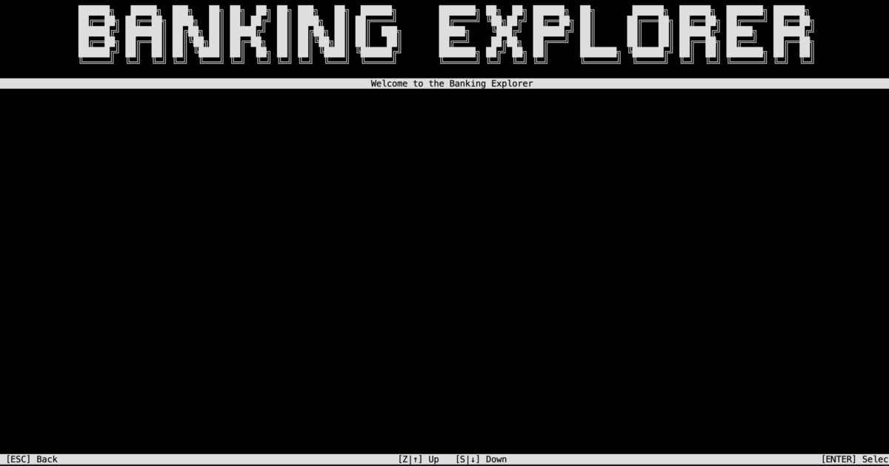

# BankingExplorer

|                    Author                     |  Size  | Lib version |                      Source files                      |
| :-------------------------------------------: | :----: | :---------: | :----------------------------------------------------: |
| [MorganKryze](https://github.com/MorganKryze) | medium |    3.3.0    | [link](https://github.com/MorganKryze/BankingExplorer) |

## Introduction

The BankingExplorer project is a simple console application that demonstrates the use of the library to create a banking assistant. You may store expenses and incomes, archive your data and view different accounts.



## Features covered

The project covers the following features:

- General: Create and use PassiveElement and InteractiveElement
- PassiveElements: `Title`, `Header` & `Footer`, `EmbedText` (formerly Interactive)
- InteractiveElements: `ScrollingMenu`, `Prompt`, `TableSelector`
- AnimatedElements: `FakeLoadingBar`

## Build & Run

### Install

To clone the project, run the following command:

```bash
git clone https://github.com/MorganKryze/BankingExplorer.git
```

Or alternatively, download the project as a zip file from the [repository](https://github.com/MorganKryze/BankingExplorer).

### Setup

#### Versions

The project is built with the latest version of the library.

The project is built with the `net8.0` target framework. Some changes should be applied to the project to make it compatible with the `net6.0` or `net7.0` target frameworks.

Check your local .NET SDK version by running the following command:

```bash
dotnet --version
```

#### Build

To build the project, open a terminal in the project directory (`./BankingExplorer`).

Then move to the working directory:

```bash
cd src/BankingExplorer
```

Finally, run the following command:

```bash
dotnet build
```

### Run

If the build is successful, run the following command:

```bash
dotnet run
```

The application should start and display the same result as in the demonstration video.
