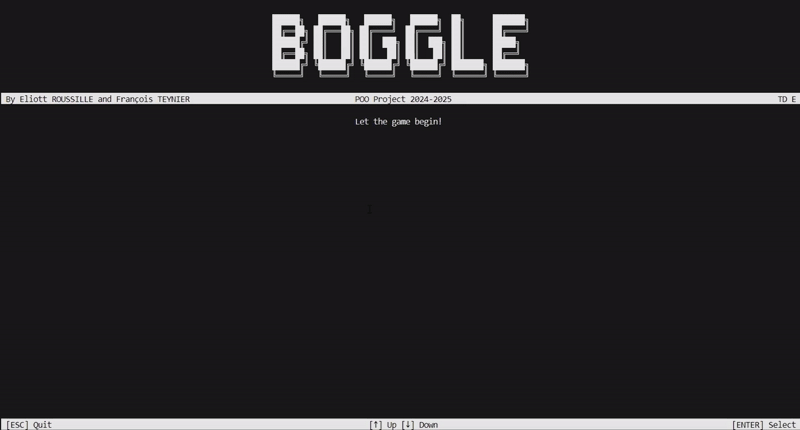

# Boggle : a word game

|                  Author                  | Size  | Library version |                  Source files                   |
| :--------------------------------------: | :---: | :-------------: | :---------------------------------------------: |
| [austin](https://github.com/Captainbleu) |  big  |     v3.5.4      | [Boggle](https://github.com/Captainbleu/Boggle) |

## Introduction

Boggle is a word game where players try to find as many words as possible from a grid of letters.



## Features covered

The project covers the following features:

- PassiveElements: `Text`, `EmbedText`, `Title`, `Header` & `Footer`, `Matrix`
- InteractiveElements: `Prompt`, `IntSelector`
- AnimatedElements: `FakeLoadingBar`

## Build & Run

### Install

To clone the project, run the following command:

```bash
git clone https://github.com/Captainbleu/Boggle.git
```

Or alternatively, download the project as a zip file from the [repository](https://github.com/Captainbleu/Boggle).

### Setup

#### Versions

The project is built with the latest version of the library.

The project is built with the `net9.0` and `net8.0` target framework. Some changes should be applied to the project to make it compatible with the `net6.0` or `net7.0` target frameworks.

Check your local .NET SDK version by running the following command:

```bash
dotnet --version
```

#### Build

To build the project, open a terminal in the project directory (`./src/Boggle`).

Then move to the working directory:

```bash
cd src/Boggle
```

Finally, run the following command:

```bash
dotnet build
```

### Run

If the build is successful, run the following command:

```bash
dotnet run
```

The application should start and display the same result as in the demonstration video.

## License

```plaintext
MIT License

Copyright (c) 2025 Austin

Permission is hereby granted, free of charge, to any person obtaining a copy
of this software and associated documentation files (the "Software"), to deal
in the Software without restriction, including without limitation the rights
to use, copy, modify, merge, publish, distribute, sublicense, and/or sell
copies of the Software, and to permit persons to whom the Software is
furnished to do so, subject to the following conditions:

The above copyright notice and this permission notice shall be included in all
copies or substantial portions of the Software.

THE SOFTWARE IS PROVIDED "AS IS", WITHOUT WARRANTY OF ANY KIND, EXPRESS OR
IMPLIED, INCLUDING BUT NOT LIMITED TO THE WARRANTIES OF MERCHANTABILITY,
FITNESS FOR A PARTICULAR PURPOSE AND NONINFRINGEMENT. IN NO EVENT SHALL THE
AUTHORS OR COPYRIGHT HOLDERS BE LIABLE FOR ANY CLAIM, DAMAGES OR OTHER
LIABILITY, WHETHER IN AN ACTION OF CONTRACT, TORT OR OTHERWISE, ARISING FROM,
OUT OF OR IN CONNECTION WITH THE SOFTWARE OR THE USE OR OTHER DEALINGS IN THE
SOFTWARE.
```

---

Have a question, give a feedback or found a bug? Feel free to [open an issue](https://github.com/MorganKryze/ConsoleAppVisuals/issues) or [start a discussion](https://github.com/MorganKryze/ConsoleAppVisuals/discussions) on the GitHub repository.
