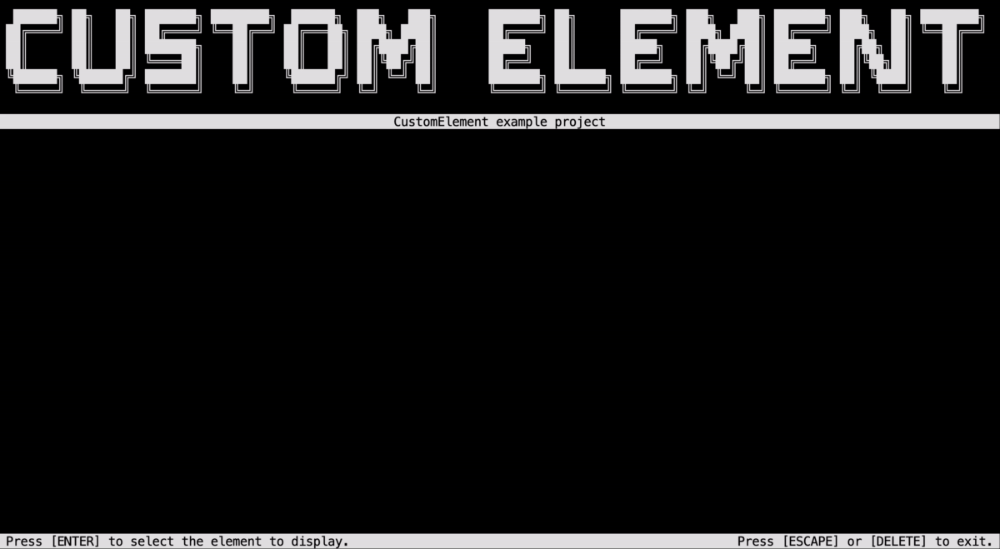

# Custom Element

|                    Author                     | Size  | Lib version |                                       Source files                                        |
| :-------------------------------------------: | :---: | :---------: | :---------------------------------------------------------------------------------------: |
| [MorganKryze](https://github.com/MorganKryze) | small |   latest    | [link](https://github.com/MorganKryze/ConsoleAppVisuals/blob/main/examples/CustomElement) |

## Introduction

The CustomElement example demonstrates the use of the library to create a custom element (Passive or Interactive) that can be used in a Console application.



## Features covered

The project covers the following features:

- General: Create and use PassiveElement and InteractiveElement
- PassiveElements: `Title`, `Header` & `Footer`
- InteractiveElements: `ScrollingMenu`

## Build & Run

### Install

To clone the project, run the following command:

```bash
git clone https://github.com/MorganKryze/ConsoleAppVisuals.git
```

Or alternatively, download the project as a zip file from the [repository](https://github.com/MorganKryze/ConsoleAppVisuals).

### Setup

#### Versions

The project is built with the latest version of the library.

The project is built with the `net8.0` target framework. Some changes should be applied to the project to make it compatible with the `net6.0` or `net7.0` target frameworks.

Check your local .NET SDK version by running the following command:

```bash
dotnet --version
```

#### Build

To build the project, open a terminal in the project directory (`./ConsoleAppVisuals`).

Then move to the working directory:

```bash
cd examples/CustomElement
```

Finally, run the following command:

```bash
dotnet build
```

### Run

If the build is successful, run the following command:

```bash
dotnet run
```

The application should start and display the same result as in the demonstration video.

---

Have a question, give a feedback or found a bug? Feel free to [open an issue](https://github.com/MorganKryze/ConsoleAppVisuals/issues) or [start a discussion](https://github.com/MorganKryze/ConsoleAppVisuals/discussions) on the GitHub repository.
