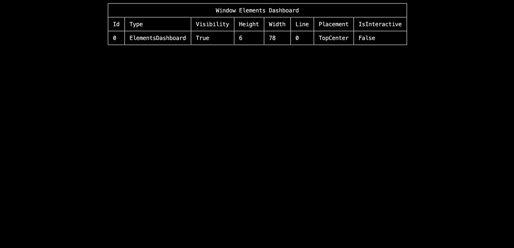
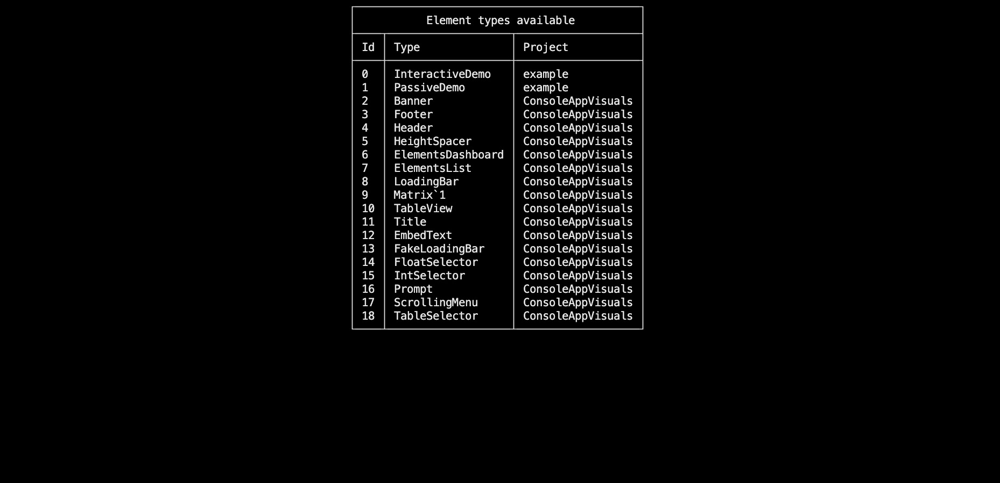

# Debugging in ConsoleAppVisuals

## Introduction

Debugging is a crucial part of software development. It is the process of identifying and removing errors from a computer program. We put a lot of effort into making debugging easier and more efficient in ConsoleAppVisuals. This article will guide you through the debugging tools and resources available in ConsoleAppVisuals to help you overcome your challenges.

## Pre-requisites

- Basic knowledge of C# programming language
- A code editor (Visual Studio, Visual Studio Code, etc.)
- ConsoleAppVisuals library installed (v3.3.0 or later)

## In-code tools

### `ElementsDashboard`

The first tool that we will discuss is the `ElementsDashboard`. It is a debugging tool that allows you to visualize the elements added to the Window. they are presented like a list of elements with their properties. This tool is very useful when you want to see the updates of the elements properties in real-time after activating, deactivating or modifying them.

```csharp
Window.Open();

ElementsDashboard dashboard = new ElementsDashboard(Placement.TopCenter, false);
Window.AddElement(dashboard);

Window.Render(dashboard);
Window.Freeze();

Window.Close();
```



> [!TIP]
> The arguments available for the `ElementsDashboard` are:
>
> - `Placement` - The position of the dashboard on the window to place it at a convenient location. (see [Placement enum](https://morgankryze.github.io/ConsoleAppVisuals/4-references/ConsoleAppVisuals.Enums.Placement.html) for more details)
> - `RoundedCorners` - A boolean value that indicates if the dashboard should have rounded corners. (purely aesthetic)

### `ElementsList`

The `ElementsList` is another debugging tool that allows you to visualize the elements inherited from the `Element`, `PassiveElement` or `InteractiveElement` classes. It lets you see their type and project location (library or your own). This tool is very useful when you want to add your custom element and see if they are recognized by the library.

```csharp
Window.Open();

ElementsList list = new ElementsList(ElementType.Default, Placement.TopCenter, false);
Window.AddElement(list);

Window.Render(list);
Window.Freeze();

Window.Close();
```



> [!TIP]
> The arguments available for the `ElementsList` are:
>
> - `ElementType` - The type of elements to display in the list. (see [ElementType enum](https://morgankryze.github.io/ConsoleAppVisuals/references/ConsoleAppVisuals.Enums.ElementType.html) for more details)
> - `Placement` - The position of the list on the window to place it at a convenient location. (see [Placement enum](https://morgankryze.github.io/ConsoleAppVisuals/3-references/ConsoleAppVisuals.Enums.Placement.html) for more details)
> - `RoundedCorners` - A boolean value that indicates if the list should have rounded corners. (purely aesthetic)

### `Core.WriteDebugMessage()`

The `Core.WriteDebugMessage()` method is a simple debugging tool that allows you to print a debug message in the console. This message overrides whatever is currently in the console and is useful when you want to display information without creating an `EmbedText` for example (it is also a quick alternative to the `Console.WriteLine()` method).

```csharp
Window.Open();

// Here the info are dummy but you may pass real elements or window variables
Core.WriteDebugMessage(Placement.TopRight, "h: 12", "w: 12", "x: 0", "y: 0");
Window.Freeze();

Window.Close();
```


> [!TIP]
> The arguments available for the `Core.WriteDebugMessage()` are:
>
> - `Placement` - The position of the message on the window to place it at a convenient location. (values can only be `TopLeft`, `TopCenter` or `TopRight`)
> - `params string[]` - The information to display in the message. (you can pass as many strings as you want) An empty string will be displayed as a blank space.

## Issues

Before getting crazy over your code, try to find a related issue in the library that tackles the subject you are struggling with. If you can't find any, feel free to open an issue on the [GitHub repository](https://github.com/MorganKryze/ConsoleAppVisuals/issues) and we will be happy to help you.

> [!NOTE]
> As the v3 of the project is still in development, no issues have been reported yet. Be the first!

## References

If you struggle with the behavior of a specific class or method, you can refer to the [detailed documentation](https://morgankryze.github.io/ConsoleAppVisuals/3-references/index.html) to find the information you need. The documentation is updated regularly and contains all the information you need to use the library.

Or simply redo the [tutorials](https://morgankryze.github.io/ConsoleAppVisuals/1-introduction/first_app.html) to get a better understanding of the library.

## Source code

Finally, if none of the above solutions work, or if you are just curious, you can always refer to the [source code](https://github.com/MorganKryze/ConsoleAppVisuals/tree/main/src/ConsoleAppVisuals).

---

Have a question, give a feedback or found a bug? Feel free to [open an issue](https://github.com/MorganKryze/ConsoleAppVisuals/issues) or [start a discussion](https://github.com/MorganKryze/ConsoleAppVisuals/discussions) on the GitHub repository.
