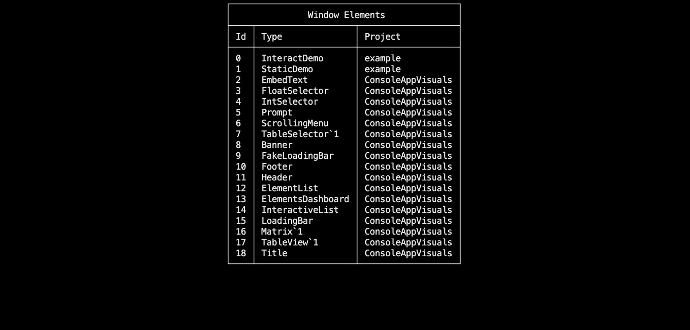
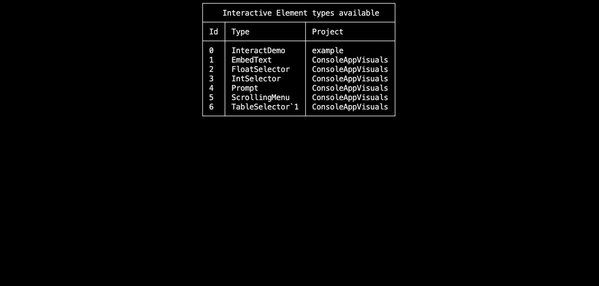

# Create your own elements

## Introduction

This article will guide you through the process of creating custom visual elements using the library. This will enable you to create passive elements as well as interactive elements that can be used in your applications.

## Prerequisites

- .NET framework 6 or later
- ConsoleAppVisuals library: 3.0.0 or later
- Having looked at the project from the [Introduction section](/introduction/index.html)

## Setup workspace

We will take the example project of the [Introduction section](/introduction/index.html).

As a reminder, here is the file structure of the project:

```bash
Example_project  <-- root
└───MyApp
    ├───bin
    ├───MyApp.csproj
    └───Program.cs
```

## Passive elements

Passive elements are visual elements that do not have any interactive behavior. They are used to display information to the user. They can be updated and change display properties.

### Setup of a passive element

Start by creating a new file in your project and name it `PassiveExample.cs`. Then, add the following code to the file (see real example in the [example project](https://github.com/MorganKryze/ConsoleAppVisuals/blob/main/example/PassiveDemo.cs)):

```csharp
using ConsoleAppVisuals;

namespace MyApp
{
    public class PassiveExample : Element
    {
        #region Fields
        // Add your custom fields here.
        #endregion

        #region Properties
        // Add overridden properties here.
        // You may also add your custom properties here.
        #endregion

        #region Constructor
        /// <summary>
        /// The natural constructor of the PassiveExample element.
        /// </summary>
        public PassiveExample(){}
        #endregion

        #region Methods
        // Add your custom methods here.
        #endregion

        #region Rendering
        /// <summary>
        /// Renders the PassiveExample element.
        /// </summary>
        protected override void RenderElementActions()
        {
            // This method is mandatory to render correctly your element. If not, an error will be thrown.
            // Add what the display code here.
        }
        #endregion
    }
}
```

### Customize your new passive element

Now let's look at the `Element` class. This class is the base class for all visual elements. It contains all the properties and methods that are necessary for the rendering of the elements. You can override some of these properties and methods to customize the behavior of your element.

The method that you can override are highlighted in yellow here:

[!code-csharp[](../assets/code/Element.cs?highlight=35,40,45,51,57,63,69,129,138,144,179)]

> [!TIP]
> Depending on the element you want to create, you may not need to override all of these methods. You can override only the ones that are necessary for your element. However I highly recommend to override these:
>
> - `MaxNumberOfThisElement`: Define the maximum number of this element that can be displayed on the screen (default is 1).
> - `RenderElementActions()`: Describe how the element should be displayed.
> - `Height` and `Width`: Depending on the element, you may want to override these properties to define the size of the element.

Once your customization is done, you may use your element in your application just like a default element.

## Interactive elements

Interactive elements are visual elements that have interactive behavior. They can be used to create buttons, prompts, menus, and other interactive elements. They can be updated and change display properties. But they also always give a response that the user can catch. The type of the response depends on the element.

### Setup of an interactive element

Similar to the passive elements, you can create interactive elements but this time they inherit from the `InteractiveElement` class. This class contains all the properties and methods that are necessary for the rendering of the elements. You can override some of these properties and methods to customize the behavior of your element.

Start by creating a new file in your project and name it `InteractiveExample.cs`. Then, create your new element following this template (see real example in the [example project](https://github.com/MorganKryze/ConsoleAppVisuals/blob/main/example/InteractiveDemo.cs)):

```csharp
using ConsoleAppVisuals;

namespace MyApp
{
    public class InteractiveExample : InteractiveElement<T>
    {
        #region Fields
        // Add your custom fields here.
        #endregion

        #region Properties
        // Add overridden properties here.
        // You may also add your custom properties here.
        #endregion

        #region Constructor
        /// <summary>
        /// The natural constructor of the InteractiveExample element.
        /// </summary>
        public InteractiveExample(){}
        #endregion

        #region Methods
        // Add your custom methods here.
        #endregion

        #region Rendering
        /// <summary>
        /// Renders the InteractiveExample element.
        /// </summary>
        protected override void RenderElementActions()
        {
            // This method is mandatory to render correctly your element. If not, an error will be thrown.
            // Add what the display code here.
        }
        #endregion
    }
}
```

### Customize your new interactive element

Now let's look at the `InteractiveElement` class. This class inherits from the `Element` class and contains all the properties and methods that are necessary for the rendering of the elements. You can override some of these properties and methods to customize the behavior of your element.

> [!IMPORTANT]
> To define a new interactive element, you must define the type of the response that the element will give. This type can be pretty much everything, but a classic type like `int`, `string`, ... is to prefer. In the example above, the type `T` is used. You can replace it with the type you want to use.

The method that you can override are the same as the `Element` class at some exceptions:

- `IsInteractive`: is set to true.
- `MaxNumberOfThisElement`: is set to one.
- `RenderOptionsBeforeHand` & `RenderOptionsBeforeHand`: cannot be modified.

The callable attributes and methods are highlighted in yellow here:

[!code-csharp[](../assets/code/InteractiveElement.cs?highlight=23,28,62)]

Two new methods are available and cannot be modified:

- `SendResponse()`: This method is called when the user interacts with the element. It is used to send a response to the window (highly recommended to see the [example project](https://github.com/MorganKryze/ConsoleAppVisuals/blob/main/example/InteractiveDemo.cs) ot understand its implementation).
- `GetResponse()`: This method is called when the user has interacted with the element. It is used to get the response from the user (defined in the `Window` class).

To understand how is defined the interaction response, I highlighted the two attributes that are used to define the response:

[!code-csharp[](../assets/code/InteractionEventArgs.cs?highlight=23,28)]

Where `State` depends on the values of the [`Output` enum](https://github.com/MorganKryze/ConsoleAppVisuals/blob/main/src/ConsoleAppVisuals/enums/Output.cs) and `Info` depends on the `T` type of the `InteractiveElement` you created.

Once your customization is done, you may use your element in your application just like a default element.

## Visualize all elements available

Now that you know how to create your own elements, you can check if they are available in the library. To do so, you can use built-in elements to display all the elements available in the library (available in the [example project](https://github.com/MorganKryze/ConsoleAppVisuals/blob/main/example/InteractiveDemo.cs)). Here is an example of how to do it:

```csharp
PassiveElementsList passiveList = new PassiveElementsList();
Window.AddElement(passiveList);


Window.Render(passiveList);
Window.Freeze();

Window.DeactivateElement(passiveList);
Window.RemoveElement(passiveList);
```



Or target only interactive elements:

```csharp
InteractiveElementsList interactiveList = new InteractiveElementsList();
Window.AddElement(interactiveList);

Window.Render(interactiveList);
Window.Freeze();

Window.DeactivateElement(interactiveList);
Window.RemoveElement(interactiveList);
```



---

Have a question, give a feedback or found a bug? Feel free to [open an issue](https://github.com/MorganKryze/ConsoleAppVisuals/issues) or [start a discussion](https://github.com/MorganKryze/ConsoleAppVisuals/discussions) on the GitHub repository.
