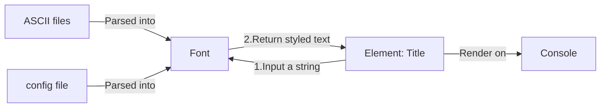

# Create and use fonts

## Introduction

This article will guide you through the process of creating your own font using the `Font` enum.


_ANSI_Shadow_


_Lil_Devil_


_Merlin_

## Prerequisites

- .NET framework 6 or later
- ConsoleAppVisuals library: 3.0.0 or later
- Having looked at the project from the [Introduction section](https://morgankryze.github.io/ConsoleAppVisuals/introduction/first_app.html)

## Setup workspace

We will take the example project of the [Introduction section](https://morgankryze.github.io/ConsoleAppVisuals/introduction/first_app.html).

As a reminder, here is the file structure of the project:

```bash
Example_project  <-- root
└───MyApp
    ├───bin
    ├───MyApp.csproj
    └───Program.cs
```

## What are fonts

In ConsoleAppVisuals, a font is a collection of ASCII characters on multiple lines associated to keys (e.g. `abc123?!/`). Some fonts are already available in the `Font` enum like the `ANSI_Shadow`, `Bulbhead`, `Lil_Devil` accessible using: `Font.ANSI_Shadow`, `Font.Bulbhead`, `Font.Lil_Devil`.

Fonts are not available to all elements, for example, find it in the `Title` element:

```csharp
Title title = new Title("Example project", 1, TextAlignment.Center, Font.ANSI_Shadow);
```

To use a custom font, update the font variable and add the font path:

```csharp
Title title = new Title("Example project", 1, TextAlignment.Center, Font.Custom, "path/to/font");
```

> [!CAUTION]
> In elements that use fonts:
>
> - If you use built-in fonts, you MUST NOT specify a font path.
> - If you use a custom font, you MUST specify a font path.

Here is a recap of fonts work:



## Creating a font

### Structure

Here is briefly the structure of a font for the ANSI_Shadow font:

```bash
ANSI_Shadow
├───data
│   ├───alphabet.txt
│   ├───numbers.txt
│   └───symbols.txt
└───config.yml
```

### Config file

The config.yml is the config file of the font. It contains the name, the author, the height of the characters and all the supported ones. Find an example below for the ANSI_Shadow font:

```yaml
name: ANSI Shadow
author: Unknown
height: 6

chars:
  alphabet: ABCDEFGHIJKLMNOPQRSTUVWXYZabcdefghijklmnopqrstuvwxyz
  numbers: 0123456789
  symbols: '?!:.,;/-_()[]%$^*@ '
```

> [!NOTE]
> Pay attention to the alphabet as the fonts are case-sensitive. In the `alphabet` category, mind to include both the upper and lower case letters. If your font does not support both, just copy and paste the letters twice. `ANSI_Shadow` font is a good example. [Find it here](https://github.com/MorganKryze/ConsoleAppVisuals/tree/main/src/ConsoleAppVisuals/fonts/ANSI_Shadow)

Here, `name`, `author`, `height` and `chars` are required. They must not be null or empty. If the author is unknown, you can put `Unknown` by convention.

In contrast, the `alphabet`, `numbers` and `symbols` are optional. If you don't have a specific category, you can let it empty and not include the ASCII file associated.

An example of empty `numbers`:

```yaml
name: Bloody
author: Unknown
height: 10

chars:
  alphabet: ABCDEFGHIJKLMNOPQRSTUVWXYZabcdefghijklmnopqrstuvwxyz
  numbers:
  symbols: ' '
```

> [!NOTE]
> It is highly recommended to have a `' '` (space) char in the `symbols` category for a readable font.

By convention, the `À`, `é`, `ü`... should be included in the `symbols` category.

### ASCII files

The ASCII files are the representation of the characters in the font. They are stored in the `data` folder. The name of the file must be the category name (e.g. `alphabet.txt`, `numbers.txt`, `symbols.txt`).

Here is an example of the `alphabet.txt` file for the `ANSI_Shadow` font:

```plaintext
██████╗  @
╚════██╗ @
  ▄███╔╝ @
  ▀▀══╝  @
  ██╗    @
  ╚═╝    @@
██╗ @
██║ @
██║ @
╚═╝ @
██╗ @
╚═╝ @@
    @
██╗ @
╚═╝ @
██╗ @
╚═╝ @
    @@
```

As you noticed:

1. All characters are 6 lines high as specified in the config file.
2. Each line ends with a `@`.
3. The final line of a character ends with a `@@`.
4. The width of the characters is not fixed. It can be different from one character to another.
5. The `@`characters are aligned for a given character.
6. One space is added between the characters and the `@` to make the result styled text more readable.
7. DO NOT USE `@` CHAR IN YOUR FONT ITSELF.

Points 1, 2, 3 are mandatory and will throw an exception if not respected. Points 4, 5, 6, 7 are optional but recommended for a better result.

> [!NOTE]
> The characters are ordered following the order given by the `chars` categories in the config file.

### Using your font

If you followed the previous steps rigorously, you should have a font ready to use. Consider the following project:

```bash
Example_project  <-- root
└───MyApp
    ├───ANSI_Shadow
    │   ├───data
    │   │   ├───alphabet.txt
    │   │   ├───numbers.txt
    │   │   └───symbols.txt
    │   └───config.yml
    ├───bin
    ├───MyApp.csproj
    └───Program.cs
```

> [!WARNING]
> Do not forget to add at the beginning of your `Program.cs` file the following using statements:
>
> ```csharp
> using ConsoleAppVisuals;
> using ConsoleAppVisuals.PassiveElements;
> using ConsoleAppVisuals.InteractiveElements;
> using ConsoleAppVisuals.Enums;
> using ConsoleAppVisuals.Models;
> ```

To check that `ANSI_Shadow` is working, update the `Program.cs` file:

```csharp
Title title = new Title("Example project", 1, TextAlignment.Center, Font.Custom, "../ANSI_Shadow/");
```

The path here leads to the font directory. The library will automatically target or the `config.yml` file and the `data` folder.

If no error was thrown, that means that the font is working. You can now use it. Here is how to manipulate the styler:

Creation:

```csharp
TextStyler styler = new TextStyler(Font.Custom, "ANSI_Shadow/");
```

Usage (String -> Styled text):

```csharp
string[] styledText = styler.Style("Hello, world!");
```

Display:

```csharp
Core.WritePositionedStyledText(styledText);
```

For more information about the `TextStyler` class and `WritePositionedStyledText()` method, please refer to the [References](https://morgankryze.github.io/ConsoleAppVisuals/references/index.html) section.

### Contributing

If you want to contribute to the library by adding a font, you can do so by creating a pull request on the [GitHub repository](https://github.com/MorganKryze/ConsoleAppVisuals/pulls).

Here are the steps to follow:

1. Fork the repository and create a new branch for your new font.
2. Add your font to the `src/ConsoleAppVisuals/fonts` directory.
3. Make sure to match all the requirements for the font defined above in the article.
4. Add your font name to the `Font` enum (`src/ConsoleAppVisuals/enums/Font.cs`) and precise the author and the height of the characters in the metadata comments.
5. Submit a pull request to the dev branch of the repository.

After these steps, your font will be reviewed and merged into the library to be available for everyone.

## Resources

- [Test fonts Figlet](https://patorjk.com/software/taag/#p=testall&f=Bell&t=Type%20Something%20)
- [Fonts collection](https://github.com/patorjk/figlet.js/tree/main/importable-fonts)

---

Have a question, give a feedback or found a bug? Feel free to [open an issue](https://github.com/MorganKryze/ConsoleAppVisuals/issues) or [start a discussion](https://github.com/MorganKryze/ConsoleAppVisuals/discussions) on the GitHub repository.
