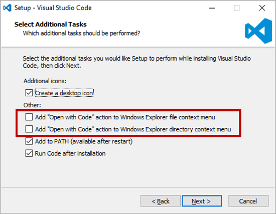
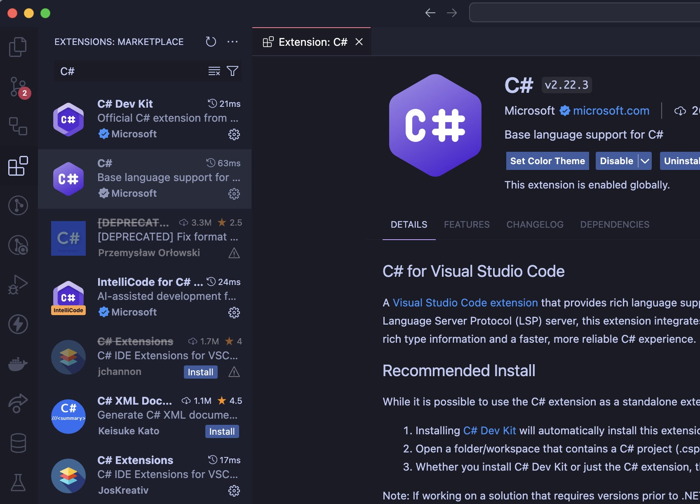
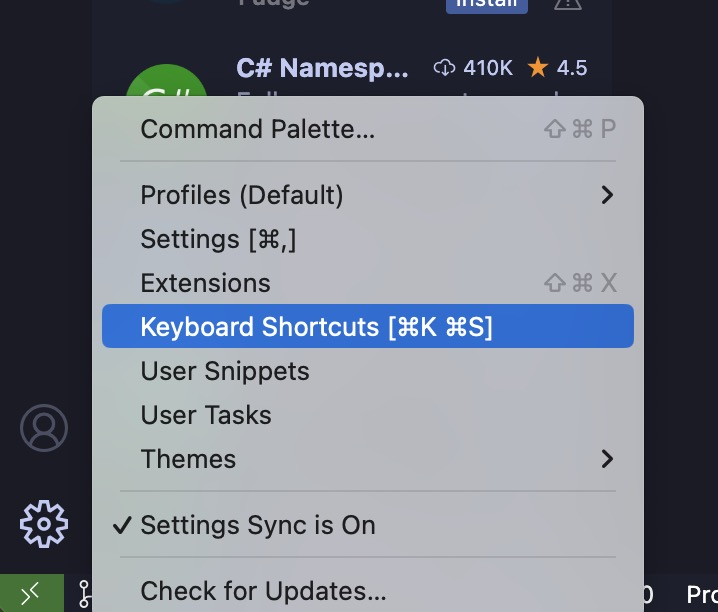
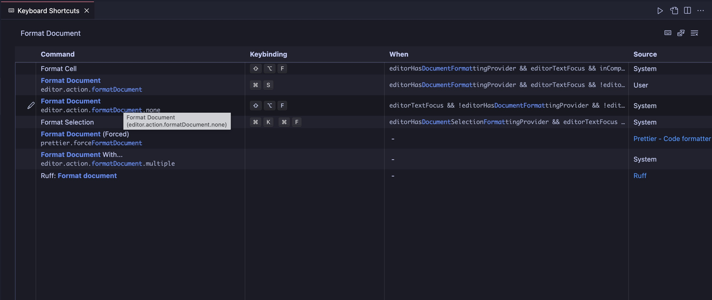

# C# for Visual Studio Code

## Introduction

This guide will help you set up your development environment for C# using Visual Studio Code. It will guide you through the installation of the .NET SDK, Visual Studio Code, and the C# extension for a complete setup.

## Install .NET SDK

The .NET SDK is a free, open-source development platform for building many different types of applications. It includes the C# compiler, the .NET runtime, and the ASP.NET Core runtime.

1. Download the .NET SDK installer from the [official website](https://dotnet.microsoft.com/download).
2. Run the installer and follow the instructions.
3. Once installed, open a new terminal and run the following command to verify the installation:

```bash
dotnet --version
```

## Install Visual Studio Code

Visual Studio Code is a free source code editor developed by Microsoft for Windows, Linux and macOS. It includes support for debugging, embedded Git control, syntax highlighting, intelligent code completion, snippets, and code refactoring.

# [Windows](#tab/windows)

1. Download the Visual Studio Code installer from the [official website](https://code.visualstudio.com/).

2. Run the installer and follow the instructions (Consider adding `Open with Code` action to Windows Explorer context menu).



3. Once installed, open Visual Studio Code.

# [MacOS](#tab/macos)

1. Download the Visual Studio Code installer from the [official website](https://code.visualstudio.com/) or use the following command in the terminal:

```bash
brew install --cask visual-studio-code
```

2. (Skip if used brew) Open the downloaded file and drag the Visual Studio Code icon to the Applications folder.

3. Once installed, open Visual Studio Code.

4. Open the Command Palette (`Ctrl+Shift+P`) and type `shell command` to find the `Shell Command: Install 'code' command in PATH` command.

# [Linux](#tab/linux)

1. Download the Visual Studio Code installer from the [official website](https://code.visualstudio.com/download) (available as `.deb` or `.rpm`). Or check the [Visual Studio Code Insiders](https://code.visualstudio.com/insiders/) version for more availability.

2. Run the installer and follow the instructions.

3. Once installed, open Visual Studio Code.

4. Open the Command Palette (`Ctrl+Shift+P`) and type `shell command` to find the `Shell Command: Install 'code' command in PATH` command.

---

## Install the C# extension

The C# extension for Visual Studio Code adds support for C# to Visual Studio Code, including features such as syntax highlighting, IntelliSense (code completion), and debugging.

Find them here:



The extensions to install are:

- [C#](https://marketplace.visualstudio.com/items?itemName=ms-dotnettools.csharp)
- [C# Extensions](https://marketplace.visualstudio.com/items?itemName=jchannon.csharpextensions)
- [C# Dev Kit](https://marketplace.visualstudio.com/items?itemName=ms-dotnettools.csdevkit)

## Bonus: Developer Tools

The following extensions are not required but can be useful:

- [CSharpier](https://marketplace.visualstudio.com/items?itemName=csharpier.csharpier-vscode)
- [tokyo-night](https://marketplace.visualstudio.com/items?itemName=Avetis.tokyo-night)
- [Reload](https://marketplace.visualstudio.com/items?itemName=natqe.reload)

Open a terminal and run the following command to install CSharpier (code formatter):

```bash
dotnet tool install --global csharpier
```

Then, open KeyboardShortcuts:



Search for `Format Document` and set the keybinding to `Ctrl+S` (or `Cmd+S` on MacOS)



Finally, open a C# file and press `Ctrl+S` (`Cmd+S` on MacOS) to format the document.

## Resources

- [To go further](https://code.visualstudio.com/Docs/languages/csharp)

---

Have a question, give a feedback or found a bug? Feel free to [open an issue](https://github.com/MorganKryze/ConsoleAppVisuals/issues) or [start a discussion](https://github.com/MorganKryze/ConsoleAppVisuals/discussions) on the GitHub repository.
