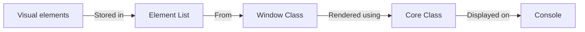
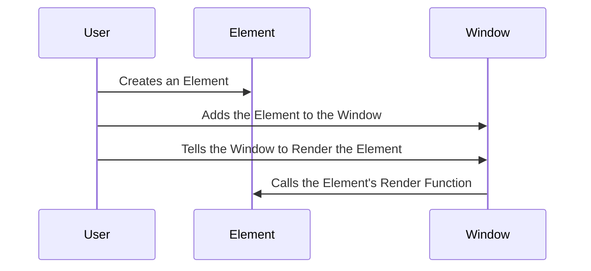

# Basic concepts

This section is made for you to understand what is ConsoleAppVisuals, its purposes, use case, how to install it use it. We will guide you into the creation of your first project and how to use the library to add visual elements to your console application.

## What is ConsoleAppVisuals?

The ambition of ConsoleAppVisuals is to provide the best compromise between an easy-to-use library and a complex tool to create console applications with visual elements. The library is designed to be simple to use and to provide a wide range of visual elements to make your console application more user-friendly and interactive.



It is relies on the concept of "visuals" which are elements that can be displayed in the console. There are two types of visuals:

- **Static visuals**: elements that do not change by themselves, you may display several from the same type at the same time
- **Interactive visuals**: elements that can be updated and create a response that can be collected, you may display only one at a time

These visuals are stored in `Window` as a list. From this class, you can display the visuals, add, remove, or update them. Each one of the visual element has its rendering method that will be called from the `Window` class.

The basics of the interaction between the library and the console are defined in the `Core` class.

## Use flow

Here is the basic visualization of the use flow of the library:



In C# terms, the use flow is as follows:

1. Creating an element:

```csharp
Title exampleTitle = new Title("Hello world!");
```

2. Adding it to the `Window`:

```csharp
Window.AddElement(exampleTitle);
```

3. Rendering the element:

```csharp
Window.Render(exampleTitle);
```

## First steps

Now that you have the basic concepts, let's dive into this guided path to know how to use the library:

- [Create a simple console application](/ConsoleAppVisuals/introduction/first_app.html)
- [Discover data visualization](/ConsoleAppVisuals/introduction/data_viz.html)
- [Manage multiple menus](/ConsoleAppVisuals/introduction/menus_managment.html)
