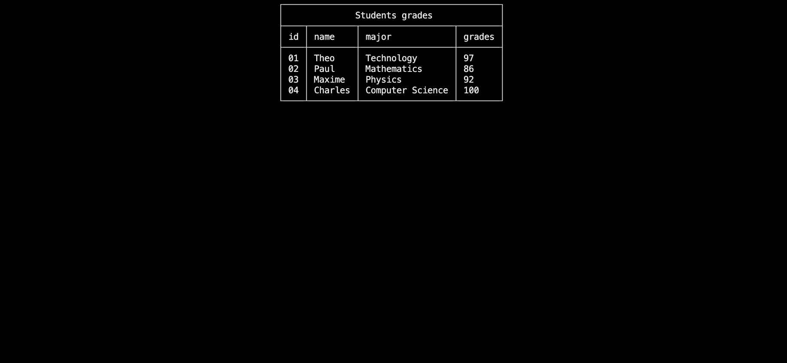
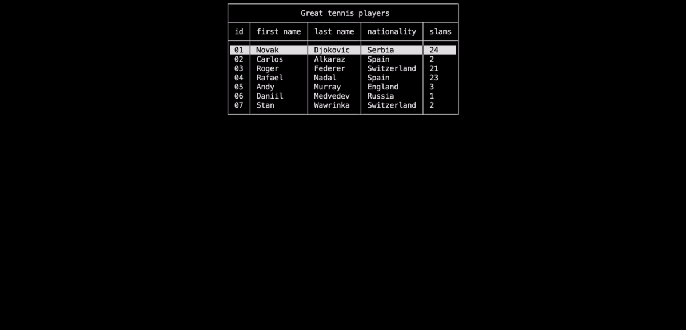
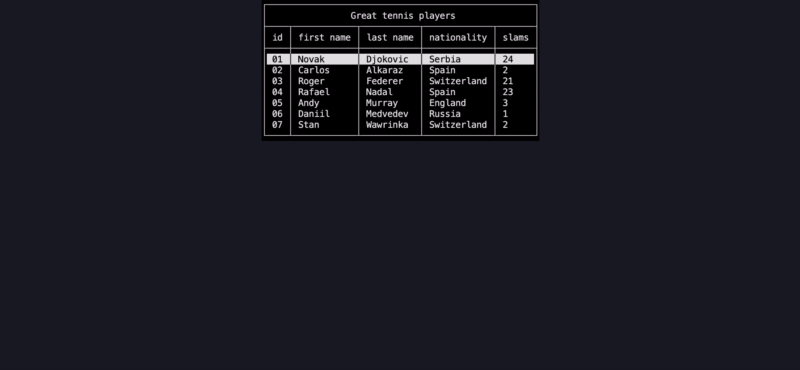

# Data visualization

In this section, you will learn:

- How to remove elements
- Discover the inspector elements
- Discover data visualization with `TableView`, `TableSelector` and `Matrix` elements

> [!TIP]
> Do not forget to give a look at the [example project](https://github.com/MorganKryze/ConsoleAppVisuals/blob/main/example/Program.cs) if you go into any trouble.

## Setup

We will be using the same project from the previous tutorial. If you haven't done it yet, please follow the steps from the First app tutorial.

Your file structure is like this:

```bash
Example_project  <-- root
└───MyApp
    ├───obj
    ├───MyApp.csproj
    └───Program.cs
```

And your cleaned `Program.cs` file should look like this:

```csharp
using System;
using ConsoleAppVisuals;
using ConsoleAppVisuals.Elements;

namespace MyApp
{
    internal class Program
    {
        static void Main(string[] args)
        {

        }
    }
}
```

## Disabling elements

We tackled adding elements to the window. Now, let's see how to do the opposite.

To disable element rendering, you have two options:

- Deactivate the element
- Remove the element

> [!TIP]
> To witness the effects of the functions we will use, we created several inspector elements.

### Deactivate the element

Deactivating an element can be useful for it to be used later. To do so, let's create a `Title` element and deactivate it. Nothing will be rendered on the screen.

```csharp
Title title = new Title("New elements");
Window.AddElement(title);

Window.DeactivateElement(title);

Window.Render();
```

Let's see how to perceive the effect of deactivating an element. Update your code to the following:

```csharp
Title title = new Title("New elements");
Window.AddElement(title);

ElementsDashboard dashboard = new ElementsDashboard();
Window.AddElement(dashboard);

Window.Render();
// Window.Freeze() will stop the execution to see the result without exiting the application
// As ElementDashboard is a static element
Window.Freeze();

Window.DeactivateElement(title);

Window.Render();
// Same as before, we need to stop the execution to see the result without exiting the application
Window.Freeze();
```


As you noticed, the title is not rendered on the screen because its Visibility property has been set to false.

### Remove the element

Removing an element is useful when you don't want to use it anymore. To do so, let's create a `Title` element and remove it. Nothing will be rendered on the screen.

```csharp
Title title = new Title("New elements");
Window.AddElement(title);

Window.RemoveElement(title);

Window.Render();
```

Let's see how to perceive the effect of removing an element. Update your code to the following:

```csharp
Title title = new Title("New elements");
Window.AddElement(title);

ElementsDashboard dashboard = new ElementsDashboard();
Window.AddElement(dashboard);

Window.Render();
Window.Freeze();

Window.RemoveElement(title);

Window.Render();
Window.Freeze();
```


## The `TableView` element

The `TableView` element is used to display data in a table format. It is useful when you want to display a list of items with multiple columns.

Let's create a `TableView` element and add it to the window.

```csharp
List<string> studentsHeaders = new List<string>() { "id", "name", "major", "grades" };

List<string> student1 = new List<string>() { "01", "Theo", "Technology", "97" };
List<string> student2 = new List<string>() { "02", "Paul", "Mathematics", "86" };
List<string> student3 = new List<string>() { "03", "Maxime", "Physics", "92" };
List<string> student4 = new List<string>() { "04", "Charles", "Computer Science", "100" };

List<List<string>> studentsData = 
    new List<List<string>>() 
    { 
        student1, 
        student2, 
        student3, 
        student4 
    };

TableView<string> students =
    new TableView<string>(
        "Students grades",
        studentsHeaders,
        studentsData
    );

Window.AddElement(students);
Window.Render(students);
// TableView is a static element, so we need to stop the execution to see it
Window.Freeze();
```



## The `TableSelector` element

The `TableSelector` element is used to display data in a table format and allow the user to select a row. It is useful when you want to be able to interact with a table.

Here is an example of how to use it:

```csharp
List<string> playersHeaders = new List<string>() { "id", "first name", "last name", "nationality", "slams" };

List<string> player1 = new List<string>() { "01", "Novak", "Djokovic", "Serbia", "24" };
List<string> player2 = new List<string>() { "02", "Carlos", "Alkaraz", "Spain", "2" };
List<string> player3 = new List<string>() { "03", "Roger", "Federer", "Switzerland", "21" };
List<string> player4 = new List<string>() { "04", "Rafael", "Nadal", "Spain", "23" };
List<string> player5 = new List<string>() { "05", "Andy", "Murray", "England", "3" };
List<string> player6 = new List<string>() { "06", "Daniil", "Medvedev", "Russia", "1" };
List<string> player7 = new List<string>() { "07", "Stan", "Wawrinka", "Switzerland", "2" };

List<List<string>> playersData =
    new List<List<string>> ()
    {
        player1,
        player2,
        player3,
        player4,
        player5,
        player6,
        player7
    };

TableSelector<string> players =
    new TableSelector<string>(
        "Great tennis players",
         playersHeaders,
         playersData
    );

Window.AddElement(players);
// Contrary to the TableView, the TableSelector is interactive,
// so we do not have to stop the execution to see it, but to activate it
Window.ActivateElement(players);
```



Now let's collect the user interaction response:

```csharp
var response = players.GetResponse();
EmbedText playersEmbedResponse =
    new EmbedText(
        new List<string>()
        {
            "Status: " + response?.Status,
            "You selected the player "
                + playersData[response?.Value ?? 0][2]
                + "!"
        }
    );

Window.AddElement(playersEmbedResponse);
Window.ActivateElement(playersEmbedResponse);
```



## The `Matrix` element

The `Matrix` element is used to display data in a matrix format.

```csharp
List<int?> firstRow = new List<int?>() { 1, null, 2, 7, 9, 3 };
List<int?> secondRow = new List<int?>() { 4, 5, 6, 8, null, 2 };
List<int?> thirdRow = new List<int?>() { 7, 8, null, 3, 4, 5 };
List<int?> fourthRow = new List<int?>() { null, 2, 3, 4, 5, 6 };

List<List<int?>> data =
    new List<List<int?>>() { 
    firstRow, 
    secondRow, 
    thirdRow, 
    fourthRow 
};

Matrix<int?> matrix = new Matrix<int?>(data);

Window.AddElement(matrix);

Window.Render(matrix);
Window.Freeze();
```


> [!TIP]
> To customize the elements, find all the available properties and methods in the [references](/ConsoleAppVisuals/references/index.html) section.
