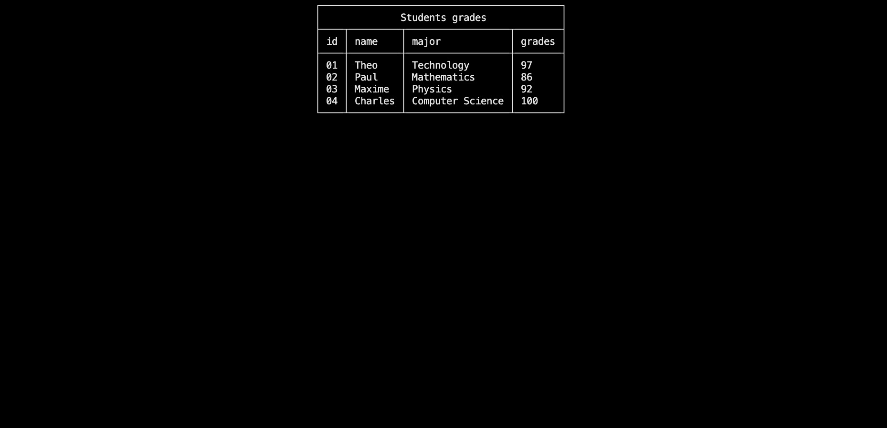

# Data visualization

In this section, you will:

- Discover data visualization with `TableView`, `TableSelector` and `Matrix` elements

> [!TIP]
> Do not forget to give a look at the [example project](https://github.com/MorganKryze/ConsoleAppVisuals/blob/main/example/Program.cs) of dive into the [references section](/ConsoleAppVisuals/references/index.html) if you go into any trouble.

## Setup

We will be using the same project from the previous tutorial. If you haven't done it yet, please follow the steps from the First app tutorial.

Your file structure is like this:

```bash
Example_project  <-- root
└───MyApp
    ├───obj
    ├───MyApp.csproj
    └───Program.cs
```

And your cleaned `Program.cs` file should look like this:

```csharp
using ConsoleAppVisuals;
using ConsoleAppVisuals.PassiveElements;
using ConsoleAppVisuals.InteractiveElements;

namespace MyApp
{
    internal class Program
    {
        static void Main(string[] args)
        {
            Window.Open();
        }
    }
}
```

## The `TableView` element

The `TableView` element is used to display data in a table format. It is useful when you want to display a list of items with multiple columns. [Learn more](https://morgankryze.github.io/ConsoleAppVisuals/references/ConsoleAppVisuals.Elements.TableView-1.html)

Let's create a `TableView` element and add it to the window.

```csharp
List<string> studentsHeaders = new List<string>() { "id", "name", "major", "grades" };

List<string> student1 = new List<string>() { "01", "Theo", "Technology", "97" };
List<string> student2 = new List<string>() { "02", "Paul", "Mathematics", "86" };
List<string> student3 = new List<string>() { "03", "Maxime", "Physics", "92" };
List<string> student4 = new List<string>() { "04", "Charles", "Computer Science", "100" };

List<List<string>> studentsData =
    new List<List<string>>()
    {
        student1,
        student2,
        student3,
        student4
    };

TableView<string> students =
    new TableView<string>(
        "Students grades",
        studentsHeaders,
        studentsData
    );

Window.AddElement(students);
Window.Render(students);
Window.Freeze();
```



## The `TableSelector` element

The `TableSelector` element is used to display data in a table format and allow the user to select a row. It is useful when you want to be able to interact with a table. [Learn more](https://morgankryze.github.io/ConsoleAppVisuals/references/ConsoleAppVisuals.Elements.TableSelector-1.html)

Here is an example of how to use it:

```csharp
List<string> playersHeaders = new List<string>() { "id", "first name", "last name", "nationality", "slams" };

List<string> player1 = new List<string>() { "01", "Novak", "Djokovic", "Serbia", "24" };
List<string> player2 = new List<string>() { "02", "Carlos", "Alkaraz", "Spain", "2" };
List<string> player3 = new List<string>() { "03", "Roger", "Federer", "Switzerland", "21" };
List<string> player4 = new List<string>() { "04", "Rafael", "Nadal", "Spain", "23" };
List<string> player5 = new List<string>() { "05", "Andy", "Murray", "England", "3" };
List<string> player6 = new List<string>() { "06", "Daniil", "Medvedev", "Russia", "1" };
List<string> player7 = new List<string>() { "07", "Stan", "Wawrinka", "Switzerland", "2" };

List<List<string>> playersData =
    new List<List<string>> ()
    {
        player1,
        player2,
        player3,
        player4,
        player5,
        player6,
        player7
    };

TableSelector<string> players =
    new TableSelector<string>(
        "Great tennis players",
         playersHeaders,
         playersData
    );

Window.AddElement(players);
// Contrary to the TableView, the TableSelector is interactive,
// so we do not have to stop the execution to see it, but to activate it
Window.ActivateElement(players);
```


Now let's collect the user interaction response by adding the following code:

```csharp
var response = players.GetResponse();

EmbedText playersEmbedResponse =
    new EmbedText(
        new List<string>()
        {
            "Status: " + response?.Status,
            "You selected the player "
                + playersData[response?.Value ?? 0][2]
                + "!"
        }
    );

Window.AddElement(playersEmbedResponse);
Window.ActivateElement(playersEmbedResponse);
```


> [!NOTE]
> Here the `??` operator is used to provide a default value if the response is `null`. In this case, if the response is `null`, the default value is `0`.

## The `Matrix` element

The `Matrix` element is used to display data in a matrix format. [Learn more](https://morgankryze.github.io/ConsoleAppVisuals/references/ConsoleAppVisuals.Elements.Matrix-1.html)

```csharp
List<int?> firstRow = new List<int?>() { 1, null, 2, 7, 9, 3 };
List<int?> secondRow = new List<int?>() { 4, 5, 6, 8, null, 2 };
List<int?> thirdRow = new List<int?>() { 7, 8, null, 3, 4, 5 };
List<int?> fourthRow = new List<int?>() { null, 2, 3, 4, 5, 6 };

List<List<int?>> data =
    new List<List<int?>>() {
    firstRow,
    secondRow,
    thirdRow,
    fourthRow
};

Matrix<int?> matrix = new Matrix<int?>(data);

Window.AddElement(matrix);

Window.Render(matrix);
Window.Freeze();
```


## Conclusion

In this tutorial, you learned how to remove elements from the window and how to use the `TableView`, `TableSelector` and `Matrix` elements. You are now ready to start the menus management tutorial.

---

Have a question, give a feedback or found a bug? Feel free to [open an issue](https://github.com/MorganKryze/ConsoleAppVisuals/issues) or [start a discussion](https://github.com/MorganKryze/ConsoleAppVisuals/discussions) on the GitHub repository.
