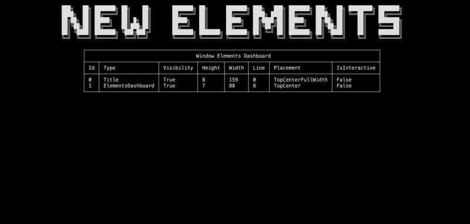
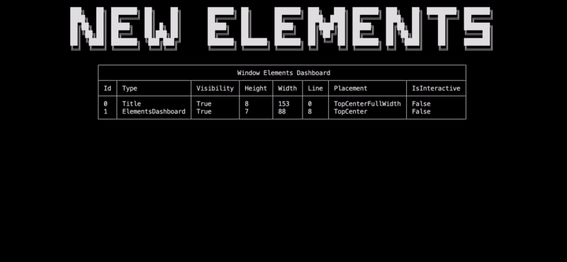

# Elements operations

In this section, you will learn:

- How to deactivate/ remove elements
- How to use the `ElementsDashboard` inspector element
- How to use the full potential of the element options

> [!TIP]
> Do not forget to give a look at the [example project](https://github.com/MorganKryze/ConsoleAppVisuals/blob/main/example/Program.cs) of dive into the [references section](/ConsoleAppVisuals/references/index.html) if you go into any trouble.

## Setup

The setup will remain the same as the previous section. If you have not done it yet, please follow the [First app](/ConsoleAppVisuals/introduction/first_app.html) tutorial.

## Disabling elements

We tackled adding elements to the window. Now, let's see how to do the opposite.

To disable element rendering, you have two options:

- Deactivate the element
- Remove the element

### Deactivate the element

Deactivating an element can be useful for it to be used later. To do so, let's create a `Title` element and deactivate it. Nothing will be rendered on the screen.

```csharp
Title title = new Title("New elements");
Window.AddElement(title);

Window.DeactivateElement(title);

Window.Render();
```

Let's see how to perceive the effect of deactivating an element. Update your code to add a `ElementsDashboard` _passive_ element and deactivate the title. The dashboard will be rendered, but not the title:

> [!NOTE]
> The method `Window.Freeze()` is used to stop the execution by waiting the user to press a key (Enter by default) to see the window content without exiting the application when the window only contains _passive_ elements.

```csharp
Title title = new Title("New elements");
Window.AddElement(title);

ElementsDashboard dashboard = new ElementsDashboard();
Window.AddElement(dashboard);

Window.Render();
Window.Freeze();

Window.DeactivateElement(title);

Window.Render();
Window.Freeze();
```



As you noticed, the title is not rendered on the screen because its Visibility property has been set to false.

### Remove the element

Removing an element is useful when you don't want to use it anymore. To do so, let's create a `Title` element and remove it. Nothing will be rendered on the screen.

```csharp
Title title = new Title("New elements");
Window.AddElement(title);

Window.RemoveElement(title);

Window.Render();
```

Let's see how to perceive the effect of removing an element. Update your code to the following:

```csharp
Title title = new Title("New elements");
Window.AddElement(title);

ElementsDashboard dashboard = new ElementsDashboard();
Window.AddElement(dashboard);

Window.Render();
Window.Freeze();

Window.RemoveElement(title);

Window.Render();
Window.Freeze();
```



## Discover elements options

### `Placement`

### `TextAlignment`

## Conclusion

---

Have a question, give a feedback or found a bug? Feel free to [open an issue](https://github.com/MorganKryze/ConsoleAppVisuals/issues) or [start a discussion](https://github.com/MorganKryze/ConsoleAppVisuals/discussions) on the GitHub repository.
