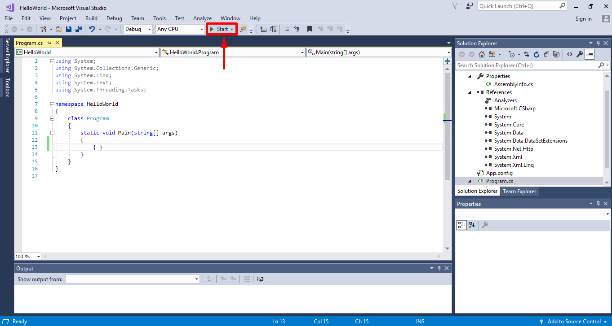
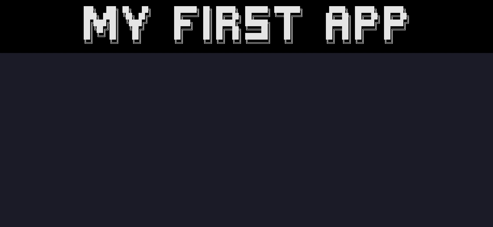
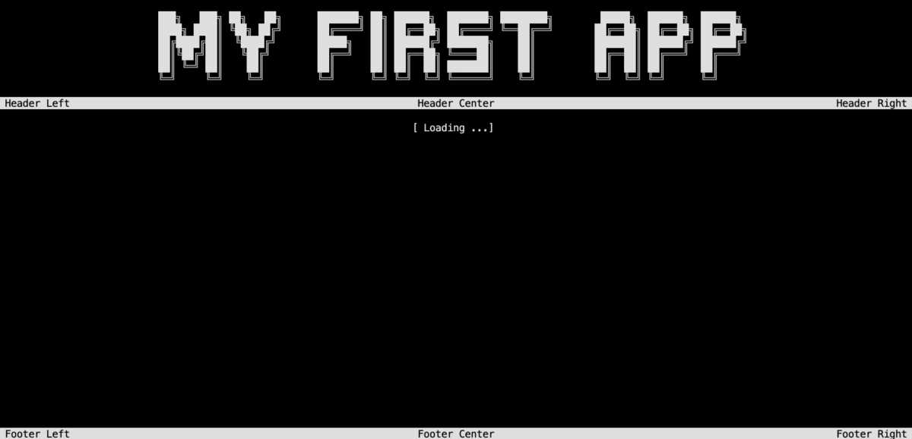
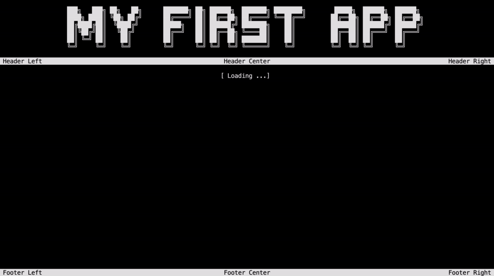
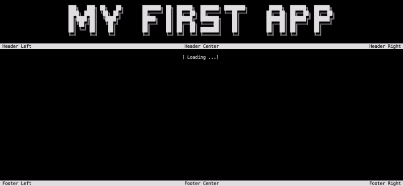
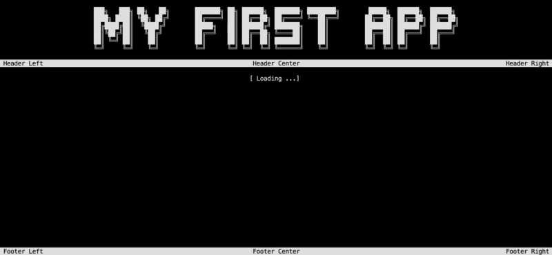

# First app

This tutorial will show you how to create a simple console application using the `ConsoleAppVisuals` package. You will learn:

- How to add elements
- Discover: `Title`, `Header` and `Footer`, `FakeLoadingBar`, `Prompt`, `EmbedText` elements
- How to get the response from the user
- How to exit the application

> [!TIP]
> Do not forget to give a look at the [example project](https://github.com/MorganKryze/ConsoleAppVisuals/blob/main/example/Program.cs) of dive into the [references section](/ConsoleAppVisuals/references/index.html) if you go into any trouble.

## Setup

First, let's create a dummy project to work with. Please choose your method according to your preference:

# [.NET CLI](#tab/cli)

Open your terminal and navigate to the folder where you want to create your project. Run the following command:

```bash
dotnet new console --output MyApp --use-program-main
```

If your file structure is like this:

```bash
Example_project  <-- root
└───MyApp
    ├───obj
    ├───MyApp.csproj
    └───Program.cs
```

Jump into the `MyApp` folder:

```bash
cd MyApp
```

Finally, run the following command to install the library:

```bash
dotnet add package ConsoleAppVisuals
```

# [Visual Studio](#tab/vs)

If you are using Visual Studio, launch the app and follow these steps in the video to create a new project:

> [!Video https://www.youtube.com/embed/1TqKF3ZJodk]

Then, install the `ConsoleAppVisuals` package by following these steps in the video and searching for `ConsoleAppVisuals`.

> [!WARNING]
> The video is about the `Newtonsoft.Json` package. You need to search for `ConsoleAppVisuals` package instead.

> [!Video https://www.youtube.com/embed/IprbRazS3b8]

---

## First steps

> [!TIP]
> Take the larger size of the console to have a better view of the result. An error may occur if the console is too small when trying to render elements.

Open the `Program.cs` file and ensure that the content is the following:

```csharp
namespace MyApp
{
    internal class Program
    {
        static void Main(string[] args)
        {
            Console.WriteLine("Hello World!");
        }
    }
}
```

# [.NET CLI](#tab/cli)

Let's try to run the app by typing the following command in your terminal:

```bash
dotnet run
```

# [Visual Studio](#tab/vs)

Let's try to run the app by clicking on the green arrow at the top of the window.



---

> [!WARNING]
> Add these using statements at the top of your `Program.cs` file to use the `ConsoleAppVisuals` package and its elements:
>
> ```csharp
> using ConsoleAppVisuals;
> using ConsoleAppVisuals.Elements;
> ```
>
> Sometimes, you will need to add more statements. All available namespaces are available in the [references](https://morgankryze.github.io/ConsoleAppVisuals/references/index.html) section.

Let's start by removing `Console.WriteLine("Hello World!");` instruction and adding the following line to your `Main` method to set up the console (clear and set the cursor invisible):

```csharp
Window.Open();
```

Now we can use all the elements from the package. Our first *static* element will be a `Title`. [Learn more](https://morgankryze.github.io/ConsoleAppVisuals/references/ConsoleAppVisuals.Elements.Title.html)

```csharp
Title title = new Title("My first app");
```

Then we can add it to the `Window`:

```csharp
Window.AddElement(title);
```

And finally, we can render the `Title` from the `Window`:

```csharp
Window.Render(title);
```



> [!TIP]
> Bonus: You may update the style of the `Title` element by giving a look at this article: [Create and use fonts](/ConsoleAppVisuals/articles/create_font.html).

## Minimal app

### `Header`, `Footer` and `FakeLoadingBar`

You may remove the previous code. Now, let's create a minimal app with a `Title`, a `Header`,  `Footer` and finally a `FakeLoadingBar` element. [Learn more](https://morgankryze.github.io/ConsoleAppVisuals/references/ConsoleAppVisuals.Elements.html)

```csharp
Window.Open();

Title title = new Title("My first app");
Window.AddElement(title);

Header header = new Header();
Window.AddElement(header);

Footer footer = new Footer();
Window.AddElement(footer);

FakeLoadingBar loadingBar = new FakeLoadingBar();
Window.AddElement(loadingBar);

Window.Render();
```

Instead of rendering each element separately, we rendered all of them at once using the `Window.Render()` method.



### `Prompt`

Now let's add a `Prompt` *interactive* element to your previous code and run it. [Learn more](https://morgankryze.github.io/ConsoleAppVisuals/references/ConsoleAppVisuals.Elements.Prompt.html)

```csharp
Prompt prompt = new Prompt("What's your name?");
Window.AddElement(prompt);

Window.Render(prompt);
```

As you may have noticed, we have the same output as earlier. No prompt was rendered on the console.

> [!IMPORTANT]
> Static elements are activated by default when added to the window. On the contrary, interactive elements need to be activated manually.

To do so, we can finally add the following line of code after the `Window.Render()`:

```csharp
Window.ActivateElement(prompt);
```



> [!TIP]
> The method `Window.ActivateElement()` will activate the element and display it on the console. Do not forget to write `Window.Render()` before to display the other *static* elements.

### Get response and `EmbedText` element

Now that we have well displayed the prompt, we can get the user's response by adding the following line of code after the `Window.ActivateElement(prompt)` line:

```csharp
var response = prompt.GetResponse();
```

> [!TIP]
> Here we use `var` to let the compiler infer the type of the variable. It is equivalent to `InteractionEventArgs<string> response = prompt.GetResponse();`. But in some case, it can be `InteractionEventArgs<int>`, `InteractionEventArgs<bool>`, etc. depending on the element. Using `var` is a good practice to keep the code clean and readable.

The previous line will retrieve a response object that has the following properties:

- `Status`: is how the interaction ended. It can be `Selected` (pressed enter), `Deleted` (pressed delete) or `Escaped` (pressed escape). It is accessible using: `response?.Status`.
- `Value`: is the user's response data. Its type depends on the Element you are using. In this case, the `Prompt` element returns a `string`. It is accessible using: `response?.Value`.

> [!NOTE]
> Here we use the `?.` operator to avoid a `NullReferenceException` if the response is `null`.
> Meaning:
>
> - If `response` is `null`, `response?.Status` will return `null`.
> - If `response` is not `null`, `response?.Status` will return `response.Status`.

Finally, let's add a `EmbedText` *interactive* element to display the user's response on the console. [Learn more](https://morgankryze.github.io/ConsoleAppVisuals/references/ConsoleAppVisuals.Elements.EmbedText.html)

```csharp
EmbedText text = new EmbedText(
    new List<string>()
    {
        "You just wrote " + response?.Value + "!",
        "And you " + response?.Status + "!"
    }
    );

Window.AddElement(text);

Window.ActivateElement(text);
```



### Exit the application

Finally, let's exit smoothly the application:

```csharp
Window.Close();
```



## Conclusion

> [!TIP]
> To customize the elements, find all the available properties and methods in the [references](/ConsoleAppVisuals/references/index.html) section.

And that's it! You have created your first app using the `ConsoleAppVisuals` package. You can now run the app and see the result.

Here is the full code:

```csharp
Window.Open();

Title title = new Title("My first app");
Window.AddElement(title);

Header header = new Header();
Window.AddElement(header);

Footer footer = new Footer();
Window.AddElement(footer);

FakeLoadingBar loadingBar = new FakeLoadingBar();
Window.AddElement(loadingBar);

Window.Render();

Prompt prompt = new Prompt("What's your name?");
Window.AddElement(prompt);

Window.ActivateElement(prompt);

var response = prompt.GetResponse();
EmbedText text = new EmbedText(
    new List<string>()
    {
        "You just wrote " + response?.Value + "!",
        "And you " + response?.Status + "!"
    }
);
Window.AddElement(text);
Window.ActivateElement(text);

Window.Close();
```
