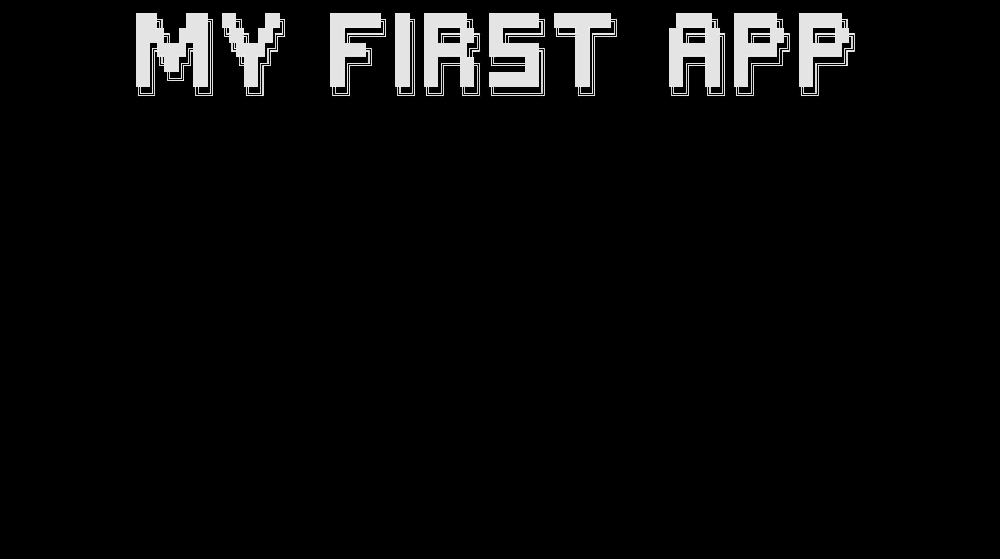

# First app

This tutorial will show you how to create a simple console application using the `ConsoleAppVisuals` package. You will learn:

- How to add elements
- Discover: `Title`, `Header` and `Footer`, `FakeLoadingBar`, `Prompt`, `EmbedText` elements
- How to get the response from the user
- How to exit the application

> [!TIP]
> Do not forget to give a look at the [example project](https://github.com/MorganKryze/ConsoleAppVisuals/blob/main/example/Program.cs) if you go into any trouble.

## Setup

First, let's create a dummy project to work with. Please choose your method according to your preference:

# [.NET CLI](#tab/cli)

Open your terminal and navigate to the folder where you want to create your project. Run the following command:

```bash
dotnet new console --output MyApp --use-program-main
```

If your file structure is like this:

```bash
Example_project  <-- root
└───MyApp
    ├───obj
    ├───MyApp.csproj
    └───Program.cs
```

Jump into the `MyApp` folder:

```bash
cd MyApp
```

Finally, run the following command to install the library:

```bash
dotnet add package ConsoleAppVisuals
```

# [Visual Studio](#tab/vs)

If you are using Visual Studio, launch the app and follow these steps in the video to create a new project:

> [!Video https://www.youtube.com/embed/1TqKF3ZJodk]

Then, install the `ConsoleAppVisuals` package by following these steps in the video:

> [!Video https://www.youtube.com/embed/IprbRazS3b8]

---

## First steps

Open the `Program.cs` file. If the content is this one below, you can remove it:

```csharp
// See https://aka.ms/new-console-template for more information
Console.WriteLine("Hello, World!");
```

And replace by the following:

```csharp
using System;

namespace MyApp
{
    internal class Program
    {
        static void Main(string[] args)
        {
            Console.WriteLine("Hello World!");
        }
    }
}
```

Now, let's add to your project the `ConsoleAppVisuals` package and `ConsoleAppVisuals.Elements` (to use the visual elements):

```csharp
using System;
using ConsoleAppVisuals;
using ConsoleAppVisuals.Elements;

namespace MyApp
{
...
```

> [!NOTE]
> All the code below will be added inside the `Main` method.

Now we can use all the elements from the package. Let's start by creating a `Title` to our application:

```csharp
Title title = new Title("My first app");
```

Then we can add it to the `Window`:

```csharp
Window.AddElement(title);
```

And finally, we can render the `Title` from the `Window`:

```csharp
Window.Render(title);
```



## Minimal app

### `Header`, `Footer` and `FakeLoadingBar`

Now, let's create a minimal app with a `Title`, a `Header`, a `Footer` and finally a `Prompt` element:

```csharp
Title title = new Title("My first app");
Window.AddElement(title);

Header header = new Header();
Window.AddElement(header);

Footer footer = new Footer();
Window.AddElement(footer);

FakeLoadingBar loadingBar = new FakeLoadingBar();
Window.AddElement(loadingBar);
```

Instead of rendering each element separately, we can render all of them at once:

```csharp
Window.Render();
```


### `Prompt`

Now let's add a `Prompt` element:

```csharp
Prompt prompt = new Prompt("What's your name?");
Window.AddElement(prompt);

Window.Render();
```

As you may have noticed, we have the same output as earlier. No prompt was displayed.

> [!IMPORTANT]
> Static elements are activated by default when added to the window. On the contrary, interactive elements need to be activated manually.

To do so, we can add the following line of code:

```csharp
Window.ActivateElement(prompt);
```


> [!TIP] `Window.ActivateElement()` is a method that will activate the element and display it on the console. Do not forget to write `Window.Render()` before to display the other elements.

### Get response and `EmbedText` element

Now that we have well displayed the prompt, we can get the user's response by adding the following line of code after the `Window.ActivateElement(prompt)` line:

```csharp
var response = prompt.GetResponse();
```

This will retrieve a response object that has the following properties:

- `Status`: is how the interaction ended. It can be `Selected` (pressed enter), `Deleted`(pressed delete) or `Escaped` (pressed escape).
- `Value`: is the user's response. Its type depends on the Element you are using. In this case, the `Prompt` element returns a `string`.

To access this data, you can use the following code:

```csharp
response?.Status;
response?.Value;
```

> [!NOTE]
> Here we use the `?.` operator to avoid a `NullReferenceException` if the response is `null`.
> Meaning:
>
> - If `response` is `null`, `response?.Status` will return `null`.
> - If `response` is not `null`, `response?.Status` will return `response.Status`.

Finally, let's add a `EmbedText` element to display the user's response:

```csharp
EmbedText text = new EmbedText(
            new List<string>()
            {
                "You just wrote " + response?.Value + "!",
                "And you " + response?.Status + "!"
            }
        );

Window.AddElement(text);

Window.ActivateElement(text);
```


### Exit the application

Finally, let's exit smoothly the application:

```csharp
Window.Close();
```


## Recap

> [!TIP]
> To customize the elements, find all the available properties and methods in the [references](/ConsoleAppVisuals/references/index.html) section.

And that's it! You have created your first app using the `ConsoleAppVisuals` package. You can now run the app and see the result.

Here is the full code:

```csharp
Title title = new Title("My first app");
Window.AddElement(title);

Header header = new Header();
Window.AddElement(header);

Footer footer = new Footer();
Window.AddElement(footer);

FakeLoadingBar loadingBar = new FakeLoadingBar();
Window.AddElement(loadingBar);

Window.Render();

Prompt prompt = new Prompt("What's your name?");
Window.AddElement(prompt);

Window.ActivateElement(prompt);

var response = prompt.GetResponse();
EmbedText text = new EmbedText(
    new List<string>()
    {
        "You just wrote " + response?.Value + "!",
        "And you " + response?.Status + "!"
    }
);
Window.AddElement(text);
Window.ActivateElement(text);

Window.Close();
```
