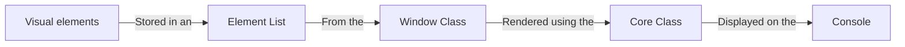
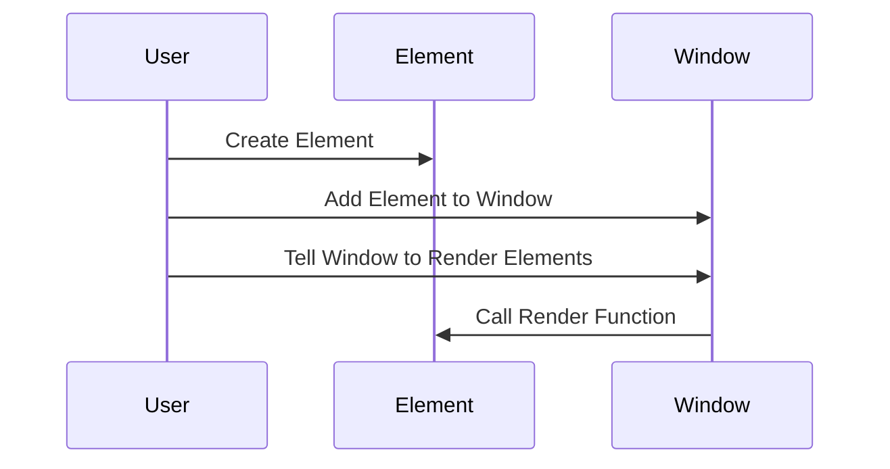

# Introduction to ConsoleAppVisuals

This section is mad for you to understand what is ConsoleAppVisuals, its purposes, use case, how to install it use it. We will guide you into the creation of your first project and how to use the library to add visual elements to your console application.

## What is ConsoleAppVisuals?

The ambition of ConsoleAppVisuals is to provide the best compromise between an easy-to-use library and a complex tool to create console applications with visual elements. The library is designed to be simple to use and to provide a wide range of visual elements to make your console application more user-friendly and interactive.



It is relies on the concept of "visuals" which are elements that can be displayed in the console. There are two types of visuals:

- **Static visuals**: elements that do not change by themselves, you may display several from the same type at the same time
- **Interactive visuals**: elements that can be updated and create a response that can be collected, you may display only one at a time

These visuals are stored in `Window` as a list. From this class, you can display the visuals, add, remove, or update them. Each one of the visual element has its rendering method that will be called from the `Window` class.

The basics of the interaction between the library and the console are defined in the `Core` class.

## Use flow

Here is the basic visualization of the use flow of the library:



In C# terms, the use flow is as follows:

1. Create an element

```csharp
Title exampleTitle = new Title("Hello world!");
```

2. Add it to `Window`

```csharp
Window.AddElement(exampleTitle);
```

3. Display the `Window`

```csharp
Window.Render();
```

Now at each refresh, the `Title` element will appear on screen. To disable it, you may add:

```csharp
Window.DeactivateElement(exampleTitle);
```

## Installation

To install the ConsoleAppVisuals library, you can use the NuGet package manager (Visual Studio) or the .NET CLI (Any other code editor).

# [.NET CLI](#tab/cli)

If your file structure is like this:

```bash
Example_project  <-- root
└───MyApp
    ├───bin
    ├───MyApp.csproj
    └───Program.cs
```

Jump into the `MyApp` folder and run the following command:

```bash
dotnet add package ConsoleAppVisuals
```

That's it! You have installed the ConsoleAppVisuals library.

# [Nuget (Visual Studio)](#tab/nuget)

If you are using Visual Studio open a C# project, then install the ConsoleAppVisuals library by following these steps in the video:

> [!Video https://www.youtube.com/embed/IprbRazS3b8]

---

## First steps

Now that you have installed the ConsoleAppVisuals library, you can start using it in your console application. Here are two use cases to get you started:

- [Create a simple console application](/ConsoleAppVisuals/introduction/first_app.html)
- [Discover new elements for your application](/ConsoleAppVisuals/introduction/advanced_app.html)
- [Manage multiple menus](/ConsoleAppVisuals/introduction/menus_managment.html)

We are always open for feedback and discussions. If you are using our library and want to share your use case, or if you have any suggestions for improvement, please feel free to [open an issue](https://github.com/MorganKryze/ConsoleAppVisuals/issues) or [open a discussion](https://github.com/MorganKryze/ConsoleAppVisuals/discussions) on our GitHub repository. Your input helps us understand possible use cases and make necessary improvements.

Do not hesitate to star and share the project if you like it!
