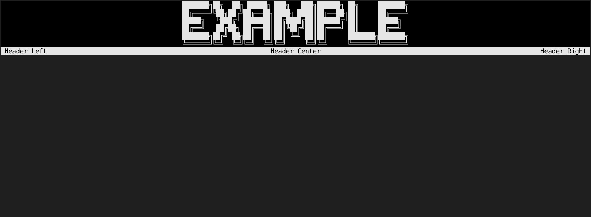

# General displays for the home screen

## Display a title

By default, no title will be displayed as no title has been set. You can set a title with the `SetTitle` method and then display it with the `WriteTitle` method.

```csharp
Core.SetTitle("Example", 2);
Core.WriteTitle();

Console.ReadKey(); //[optional]: just to keep the console clean
```


*Demo with an Example*

## Display a banner

Now that we have seen the title, let's see how to display a banner. You may use the default arguments or define your own if you prefer an instant result, specify if you want to display the header or the footer or display your own banner.

```csharp
Core.SetTitle("Example", 2);
Core.WriteTitle();

Core.WriteHeader();

Console.ReadKey(); //[optional]: just to keep the console clean
```


*Demo with default arguments for the header*

To customize the banner, you can change the arguments or change the default header and footer with the `SetDefaultHeader` or `SetDefaultFooter` methods.

```csharp
Core.SetDefaultHeader(("Left", "Top", "Right"));
Core.WriteHeader(true);
Core.WriteFooter(true, ("Left", "Top", "Right"));

Console.ReadKey();
```


*Demo with custom arguments for the header*

## Easy display

The `WriteFullScreen` method is the easiest way to display a banner and a title. It will display the banner and the title with the default arguments. Here is an example of what this method replaces:

```csharp
Core.WriteFullScreen("Example");

// Instead of:
// Core.SetTitle("Example", 2);
// Core.WriteTitle();
// 
// Core.SetDefaultHeader(("Left", "Top", "Right"));
// Core.SetDefaultFooter(("Left", "Top", "Right"));
// Core.WriteHeader();
// Core.WriteFooter();
// 
// Core.ClearContent();
```
